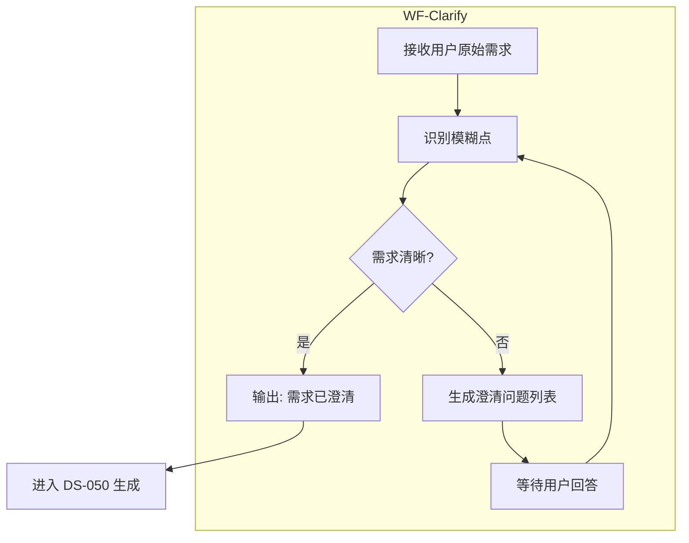

# CDD Skill v1.3.0 下一步集成计划 (Phase 2)

**版本**: v1.3.0-phase2  
**日期**: 2026-02-01  
**状态**: Draft → Review  
**优先级**: P0 (Clarify + Tasks), P1 (Context Packer)

---

## 1. 规划概述

### 1.1 目标

在已完成 DS-050/DS-051 集成的基础上，进一步引入 Clarify、Tasks、Checklist 模块，使 CDD 从"文档治理"进化为"精细化执行"。

### 1.2 集成清单 (Phase 2)

| 模块 | CDD对应缺口 | 产出 | 优先级 |
|------|-------------|------|--------|
| **Clarify** | State B 缺乏去歧义机制 | WF-Clarify (澄清工作流) | P0 |
| **Tasks** | State C 缺乏原子任务单元 | DS-052 (原子任务清单) | P0 |
| **Checklist** | State D 缺乏执行细节检查 | DS-053 (质量验收检查单) | P1 |
| **Context Packer** | 上下文溢出问题 | 上下文加载策略 | P1 |

---

## 2. WF-Clarify (澄清工作流)

### 2.1 概述

**工作流ID**: WF-Clarify  
**来源**: spec-kit clarify 理念  
**位置**: State B 前置守卫  
**目标**: 在生成 Spec 前，强制 AI 提出澄清问题

### 2.2 工作流结构



### 2.3 触发条件

| 场景 | 触发? |
|------|-------|
| 用户需求包含模糊词汇 (如"高性能"、"用户友好") | ✅ |
| 缺少量化指标 (如响应时间、数据量) | ✅ |
| 依赖关系不明确 | ✅ |
| 已有明确的验收标准 | ❌ 跳过 |

### 2.4 输出模板

```markdown
# 需求澄清报告

**原始需求**: [用户输入]
**分析时间**: {{TIMESTAMP}}

## 识别出的模糊点

| # | 模糊描述 | 澄清问题 | 优先级 |
|---|----------|----------|--------|
| 1 | "高性能" | "请定义具体的响应时间目标 (P95 < ?ms)" | 高 |
| 2 | "用户友好" | "请列出关键的可用性指标" | 中 |

## 待用户回答

1. [问题1]
2. [问题2]
3. [问题3]

## 状态
- [ ] 待回答
- [ ] 已回答 → 可进入 DS-050 生成
```

### 2.5 实施任务

- [ ] 创建 `templates/workflows/WF-CLARIFY.md`
- [ ] 更新 `WF-201` State B 流程，添加 Clarify 阶段
- [ ] 在 SKILL.md 中定义触发条件

---

## 3. DS-052 (原子任务清单标准)

### 3.1 概述

**标准ID**: DS-052  
**来源**: spec-kit tasks-template.md  
**用途**: 将 Plan 拆解为可执行的原子任务单元  
**位置**: State C 执行驱动

### 3.2 模板结构

```markdown
# Tasks: [FEATURE NAME]

**Feature**: [链接到 DS-050]
**Plan**: [链接到 DS-051]
**创建时间**: {{TIMESTAMP}}
**状态**: Draft → In Progress → Done

---

## 格式说明

- **[P]**: 可并行执行 (不同文件，无依赖)
- **[ID]**: 任务编号 (T001, T002...)
- **[Story]**: 所属用户故事 (US1, US2...)

---

## Phase 1: [阶段名称]

**目的**: [描述]

### 用户故事 1: [故事标题] (P1)

- [ ] T001 [P] [US1] [任务描述]
  - 文件: `src/xxx/yyy.py`
  - 验证: `pytest tests/test_xxx.py`
  
- [ ] T002 [US1] [任务描述]
  - 依赖: T001
  - 文件: `src/xxx/zzz.py`
  - 验证: `pytest tests/test_zzz.py`

---

## 任务统计

| 指标 | 数量 |
|------|------|
| 总任务数 | N |
| P1 用户故事任务 | N |
| P2 用户故事任务 | N |
| 可并行任务 | N |

---

## 进度追踪

| 任务ID | 状态 | 完成时间 | 备注 |
|--------|------|----------|------|
| T001 | ☐ | | |
| T002 | ☐ | | |
```

### 3.3 与 activeContext 集成

在 `activeContext.md` 中添加:

```markdown
## 当前任务 (Current Task)

| 字段 | 值 |
|------|-----|
| **活动任务** | T001: [任务描述] |
| **所属故事** | US1 |
| **计划文件** | `specs/[###-feature]/tasks.md` |
| **下一步任务** | T002 |
| **依赖完成** | ✅ |
```

### 3.4 实施任务

- [ ] 创建 `templates/standards/DS-052_ATOMIC_TASKS.md`
- [ ] 更新 `WF-201` State C 流程，引用 DS-052
- [ ] 更新 `activeContext.md` 模板，添加 Current Task 字段

---

## 4. DS-053 (质量验收检查单标准)

### 4.1 概述

**标准ID**: DS-053  
**来源**: spec-kit checklist-template.md  
**用途**: State D 退出标准 (Exit Criteria) 检查  
**位置**: State D → State E

### 4.2 模板结构

```markdown
# Checklist: [FEATURE NAME]

**Feature**: [链接]
**创建时间**: {{TIMESTAMP}}
**检查类型**: Exit Criteria

---

## State A 检查 (上下文)

- [ ] CHK-A001 README.md 已加载并解析
- [ ] CHK-A002 5个 T0 文档已加载
- [ ] CHK-A003 3个 T1 文档已加载
- [ ] CHK-A004 熵值基线已计算

## State B 检查 (规范)

- [ ] CHK-B001 DS-050 规范已生成
- [ ] CHK-B002 DS-051 计划已生成
- [ ] CHK-B003 用户已审批 (Approved)
- [ ] CHK-B004 Clarify 问题已回答 (如适用)

## State C 检查 (执行)

- [ ] CHK-C001 所有任务已完成 (T001-T00N)
- [ ] CHK-C002 代码已提交 (git commit)
- [ ] CHK-C003 无调试代码残留

## State D 检查 (验证)

### Tier 1: 结构验证
- [ ] CHK-D001 文件结构符合 `systemPatterns.md`
- [ ] CHK-D002 命名规范正确
- [ ] CHK-D003 依赖方向正确

### Tier 2: 签名验证
- [ ] CHK-D004 接口实现完整
- [ ] CHK-D005 参数类型一致

### Tier 3: 行为验证
- [ ] CHK-D006 P1 用户故事有测试覆盖
- [ ] CHK-D007 验收场景全部通过
- [ ] CHK-D008 业务不变量未违反

## State E 检查 (收敛)

- [ ] CHK-E001 $H_{sys} \leq 0.3$
- [ ] CHK-E002 T0 文档已更新
- [ ] CHK-E003 外部审计通过 (如适用)

---

## 检查结果

| 状态 | 通过项 | 未通过项 |
|------|--------|----------|
| 通过 | / | 0 |
| 未通过 | / | N |

**检查人**: [签名]  
**日期**: {{TIMESTAMP}}
```

### 4.3 实施任务

- [ ] 创建 `templates/standards/DS-053_QUALITY_CHECKLIST.md`
- [ ] 集成到 State D → State E 转换逻辑

---

## 5. Context Packer (上下文工程)

### 5.1 概述

**功能**: 智能上下文打包与加载策略  
**来源**: spec-kit `update-agent-context.sh` 思路  
**目标**: 解决长上下文溢出问题

### 5.2 上下文模式定义

| 模式 | 加载内容 | 卸载内容 | 适用场景 |
|------|----------|----------|----------|
| **Planning** | T0 + T1 + DS-050 + DS-051 | - | State A, B |
| **Coding** | DS-050 + DS-051 + DS-052 + 当前文件 | T0 索引, T1 完整内容 | State C |
| **Verifying** | DS-050 + 验证结果 | - | State D |
| **Calibrating** | activeContext + 验证结果 | - | State E |

### 5.3 打包算法

```python
class ContextPacker:
    """CDD 上下文打包器"""
    
    def pack_context(mode: str, current_task: dict) -> dict:
        """
        根据模式打包上下文
        
        Args:
            mode: Planning/Coding/Verifying/Calibrating
            current_task: 当前任务信息
            
        Returns:
            打包后的上下文 (保持 < 8000 tokens)
        """
        if mode == "Planning":
            return {
                "t0_documents": load_all_t0(),      # 全部加载
                "t1_documents": load_all_t1(),      # 全部加载
                "spec": load_ds050(),               # 当前Spec
                "plan": load_ds051(),               # 当前Plan
                "max_tokens": 8000
            }
        elif mode == "Coding":
            return {
                "spec_summary": summarize_ds050(),  # 仅摘要
                "current_step": load_ds051_step(),  # 当前步骤
                "current_tasks": load_ds052_task(), # 当前任务
                "file_content": load_current_file(),# 当前编辑文件
                "max_tokens": 4000                  # 留空间给代码
            }
        # ... 其他模式
```

### 5.4 实施任务

- [ ] 创建 `scripts/context_packer.py`
- [ ] 更新 SKILL.md，定义上下文模式
- [ ] 在 State C 执行前调用 pack_context

---

## 6. 实施路线图

### Phase 2.1: Clarify + Tasks (Week 1-2)

| 任务 | 产出 | 状态 |
|------|------|------|
| 创建 WF-Clarify | `templates/workflows/WF-CLARIFY.md` | 待开始 |
| 更新 WF-201 | State B 集成 Clarify 阶段 | 待开始 |
| 创建 DS-052 | `templates/standards/DS-052_xxx.md` | 待开始 |
| 更新 activeContext | Current Task 字段 | 待开始 |
| 外部审计 | 验证集成合规性 | 待开始 |

### Phase 2.2: Checklist + Context (Week 3-4)

| 任务 | 产出 | 状态 |
|------|------|------|
| 创建 DS-053 | `templates/standards/DS-053_xxx.md` | 待开始 |
| 创建 context_packer | `scripts/context_packer.py` | 待开始 |
| 更新 SKILL.md | 上下文模式定义 | 待开始 |
| 外部审计 | v1.3.0 完整审计 | 待开始 |

---

## 7. 预期收益

| 指标 | 当前状态 | 集成后 |
|------|----------|--------|
| 需求歧义率 | 高 | 低 (Clarify) |
| 任务可视度 | 低 | 100% (Tasks) |
| 验证完整性 | 中 | 高 (Checklist) |
| 上下文效率 | 低 | 高 (Packer) |

---

## 8. 风险与缓解

| 风险 | 影响 | 缓解措施 |
|------|------|----------|
| 流程变复杂 | 学习曲线增加 | 提供完整示例 |
| 模板过多 | 维护困难 | 标准化命名和结构 |
| 上下文打包开销 | 开发效率 | 渐进式集成 |

---

**规划者**: CDD Architect  
**创建时间**: 2026-02-01T16:50+08:00  
**状态**: Draft
