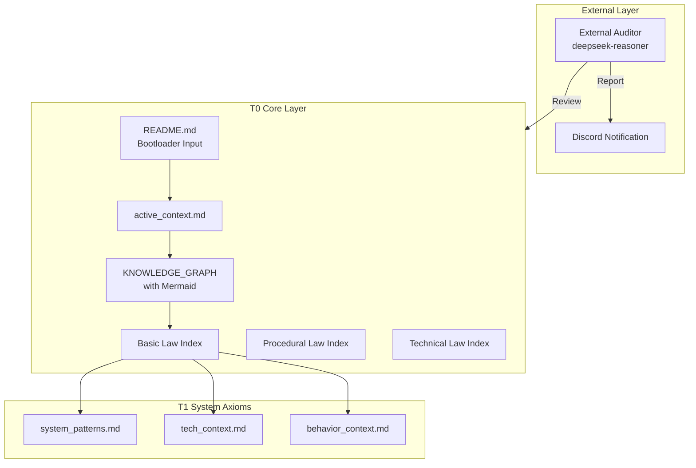

# Constitution-Driven Development Skill (CDD)

**Version**: 1.5.0  
**Codename**: Ecosystem & Automation  
**License**: Apache-2.0  
**Author**: wsman

A comprehensive skill for OpenClaw that implements Constitution-Driven Development (CDD) methodology using MiniMax M2.1 model. Features ecosystem automation, GitHub integration, and governance protocols.

## Overview

CDD is a systematic approach to AI-assisted software development that enforces strict documentation-driven workflows, three-tier verification, and system entropy monitoring. v1.5.0 introduces ecosystem automation with GitHub sync, feature scaffolding, and constitution amendment protocols.

## Features

- 📜 **T0/T1/T2 Document System**: Core consciousness → System axioms → Executable standards
- 🔄 **Five-State Workflow**: A→B→C→D→E (Ingest → Plan → Execute → Verify → Converge)
- ✅ **Three-Tier Verification**: Structure → Signatures → Behavior
- 📊 **Entropy Monitoring**: Real-time $H_{sys}$ metrics with compliance-based scoring
- 🤖 **External Auditor**: Third-party AI review with deepseek-reasoner
- 🚀 **Ecosystem Automation**: GitHub Issues sync, feature scaffolding scripts
- ⚖️ **Governance Protocols**: Constitution amendment workflows (SemVer-based)
- 📋 **Knowledge Graph**: Mermaid visualization support

## Document Hierarchy

| Level | Name | Tokens | Description |
|-------|------|--------|-------------|
| **T0** | Core Consciousness | <800 | Must always be loaded (5 core documents) |
| **T1** | System Axioms | <200 | NEW: systemPatterns, techContext, behaviorContext |
| **T2** | Executable Standards | <100/task | Lazy loaded on demand (DS/WF files) |
| **T3** | Archives | 0 | Loaded only for audit |

## Architecture



## Core Workflow (Closed-Loop)

```
1. Load README.md (Bootloader Input - One-shot)
2. Load All 5 T0 Documents + 3 T1 Documents
3. Calculate H_sys (Entropy Baseline)
4. Execute CDD Five-State Workflow (A→B→C→D→E)
5. Detect T0 Changes
   ├─ No Change → Continue Development
   └─ Change → Trigger External Audit
6. External Audit (deepseek-reasoner, max_tokens=8192)
   ├─ Review T0 Documents
   ├─ Generate Report with real API data
   └─ Send to Discord
7. User Confirmation
8. Closed-Loop Verification (Tier 1/2/3)
9. Complete/Continue
```

## Quick Start

```bash
# Clone this skill to your OpenClaw skills directory
git clone https://github.com/wsman/Constitution-Driven-Development-Skill.git
cp -r Constitution-Driven-Development-Skill/ ../openclaw/skills/cdd/

# For a new project, create Memory Bank:
cd /path/to/your/project
mkdir -p memory_bank/core
mkdir -p memory_bank/axioms
mkdir -p memory_bank/protocols
mkdir -p memory_bank/standards

# Copy T0 templates (core)
cp cdd/templates/core/*_index.md memory_bank/core/
cp cdd/templates/core/active_context.md memory_bank/core/
cp cdd/templates/core/knowledge_graph.md memory_bank/core/

# Copy T1 templates (axioms)
cp cdd/templates/axioms/system_patterns.md memory_bank/axioms/
cp cdd/templates/axioms/tech_context.md memory_bank/axioms/
cp cdd/templates/axioms/behavior_context.md memory_bank/axioms/

# Copy T2 templates (protocols/standards)
cp cdd/templates/protocols/*.md memory_bank/protocols/
cp cdd/templates/standards/*.md memory_bank/standards/

# Create project README from template
cp cdd/templates/core/project_readme_template.md README.md
```

## Structure

```
cdd/
├── SKILL.md                         # Main skill file (v1.3.2, with Appendix A)
├── README.md                        # This file (v1.3.2)
├── templates/                       # T0/T1 document templates
│   ├── core/                        # T0-核心意识层
│   │   ├── active_context.md        # Active Context (v1.3.2)
│   │   ├── basic_law_index.md       # Basic Law Index
│   │   ├── knowledge_graph.md       # Knowledge Graph (v1.3.2, Mermaid)
│   │   ├── procedural_law_index.md  # Procedural Law Index
│   │   ├── technical_law_index.md   # Technical Law Index
│   │   ├── guide.md                 # Template Usage Guide
│   │   └── project_readme_template.md  # Project README Template
│   ├── axioms/                      # T1-系统公理层
│   │   ├── system_patterns.md       # Architecture patterns
│   │   ├── tech_context.md          # Interface signatures
│   │   └── behavior_context.md      # Behavior assertions
│   ├── protocols/                   # T2-工作流协议
│   │   ├── WF-001_clarify_workflow.md
│   │   └── WF-201_cdd_workflow.md
│   ├── standards/                   # T2-DS实现标准
│   │   ├── DS-007_context_management.md
│   │   ├── DS-050_feature_specification.md
│   │   ├── DS-051_implementation_plan.md
│   │   └── DS-052_atomic_tasks.md
│   └── cdd_config.yaml              # CDD Configuration
└── scripts/
    └── measure_entropy.py           # Entropy calculation script (v1.3.2)
```

## Core Mathematics (v1.3.2)

**System Entropy** (Updated with H_align):
$$
H_{sys} = 0.4 \cdot H_{cog} + 0.3 \cdot H_{struct} + 0.3 \cdot H_{align}
$$

Where:
- **H_cog** (Cognitive Load): $T_{load} / 8000$
- **H_struct** (Structural Entropy): $1 - N_{linked}/N_{total}$
- **H_align** (Alignment Deviation): $N_{violation} / N_{constraints}$ (NEW)

**Calibration Standard** (v1.3.2):
- 🟢 **Excellent**: $0.0 - 0.3$ (Calibration Target)
- 🟡 **Good**: $0.3 - 0.5$ (Normal Development)
- 🟠 **Warning**: $0.5 - 0.7$ (Start Repairs)
- 🔴 **Danger**: $0.7 - 1.0$ (Force Refactoring)

**Attention Distribution**:
$$
\text{Attention}(T0) \gg \text{Attention}(T1) > \text{Attention}(T2) \gg \text{Attention}(T3)
$$

## Usage

Use with OpenClaw + MiniMax M2.1 for development, DeepSeek-Reasoner for auditing:

```bash
# In OpenClaw
/cdd "Your development task description"
```

## 🛡️ 宪法门禁 (Constitutional Guardrails)

本项目实施了严格的 CDD 自动化审计（GitHub Actions）。任何 PR 必须通过以下三道门禁才能合并：

| 门禁 (Gate) | 检查项 | 失败原因 | 修复方法 |
|-------------|--------|----------|----------|
| **Gate 1** | **版本一致性** | 文档版本号不统一 (违反 §102.3) | 运行 `python scripts/verify_versions.py --fix` |
| **Gate 2** | **行为验证** | 单元测试失败 (功能倒退) | 运行 `pytest` 并修复代码逻辑 |
| **Gate 3** | **熵值监控** | 系统熵值 $H_{sys} > 0.5$ | 运行 `python scripts/measure_entropy.py` 查看详情，进行重构或文档对齐 |

> **提示**: 在提交代码前，建议在本地运行所有检查以避免流水线失败。

## CDD Workflow

1. **State A (Context Ingestion)**: Load T0 + T1 documents
2. **State B (Documentation First)**: Plan in T0/T1 docs, wait for approval
3. **State C (Safe Implementation)**: Execute code changes
4. **State D (Three-Tier Verification)**:
   - **Tier 1**: Structure ($S_{fs} \cong S_{doc}$) vs `system_patterns.md`
   - **Tier 2**: Signatures ($I_{code} \supseteq I_{doc}$) vs `tech_context.md`
   - **Tier 3**: Behavior ($B_{code} \equiv B_{spec}$) vs `behavior_context.md`
5. **State E (Converge)**: Calibrate $H_{sys} \leq 0.3$, complete

## External Auditor (v1.3.2)

CDD includes an **External Auditor** for third-party AI review:

- **Trigger**: T0 document changes
- **Model**: deepseek-reasoner
- **Max Tokens**: 8192 (for complete audit output)
- **Scope**: T0 documents only
- **Output**: Markdown report with real API data → Discord notification

**API Data Requirement** (v1.3.2):
- Request ID, timestamps, latency (ms), token counts (exact, no estimates)

## Closed-Loop Verification Checklist

Before completing any task, verify:

| Check | Standard | Template |
|-------|----------|----------|
| Code ↔ Architecture Isomorphism | `code` ≅ `system_patterns.md` | system_patterns.md |
| Interface ↔ Signature Match | `interface` ⊇ `tech_context.md` | tech_context.md |
| Behavior ↔ Assertion Consistency | `behavior` ≡ `behavior_context.md` | behavior_context.md |
| T0 Documents Synced | All 5 T0 docs updated | - |
| Entropy Calibrated | $H_{sys} \leq 0.3$ | active_context.md |
| External Audit Passed | (If T0 changed) | Audit Report |

## References

- See `SKILL.md` Appendix A for entropy calculation scripts
- See `templates/guide.md` for template usage guide
- See `templates/knowledge_graph.md` for Mermaid visualization examples
- See `templates/system_patterns.md` for Tier 1 verification template
- See `templates/tech_context.md` for Tier 2 verification template
- See `templates/behavior_context.md` for Tier 3 verification template

## 🚀 CDD v1.5.0 (Ecosystem & Automation) - Gold Release

**Status**: 🟢 Production Ready | **Score**: 9.0/10 | **Audit**: deepseek-reasoner

### v1.5.0 New Features

| Component | Function |
|-----------|----------|
| `scripts/cdd-feature.py` | Feature scaffolding: auto-numbering, Git branch creation, template instantiation |
| `templates/protocols/WF-sync-issues.md` | GitHub Issues sync protocol (DS-052 → Issues) |
| `templates/protocols/WF-amend.md` | Constitution amendment protocol (SemVer-based) |
| `templates/cdd_config.yaml` | github_integration + governance configuration |
| `MIGRATION_GUIDE.md` | v1.4.0 → v1.5.0 upgrade guide |

### Quick Start (v1.5.0)

```bash
# Clone
git clone https://github.com/wsman/Constitution-Driven-Development-Skill.git
cd Constitution-Driven-Development-Skill

# Create new feature
python scripts/cdd-feature.py "Add User Login"

# Dry run (no changes)
python scripts/cdd-feature.py "Add User Login" --dry-run
```

### Version Milestones

| Version | Focus |
|---------|-------|
| v1.0-v1.2 | T0/T1/T2 document system + five-state workflow |
| v1.3 | Entropy metrics + external auditing |
| v1.4 | Quality gates integration |
| v1.5 | Ecosystem automation (current) |

### Documentation

- [MIGRATION_GUIDE.md](MIGRATION_GUIDE.md) - Upgrade from v1.4.0
- [SKILL.md](SKILL.md) - Complete skill documentation

## License

Licensed under the Apache License, Version 2.0. See LICENSE file for details.
