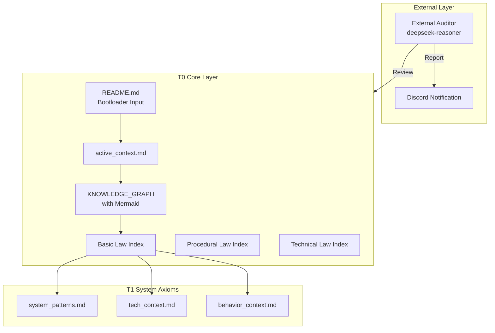

# Constitution-Driven Development Skill (CDD)

**Version**: 1.6.1  
**Codename**: Memory Bank First  
**License**: Apache-2.0  
**Author**: wsman

A comprehensive skill for OpenClaw that implements Constitution-Driven Development (CDD) methodology using MiniMax M2.1 model. Features **Memory Bank First** architecture, ecosystem automation, GitHub integration, and governance protocols.

## Overview

CDD is a systematic approach to AI-assisted software development that enforces strict documentation-driven workflows, three-tier verification, and system entropy monitoring. v1.6.1 introduces **Memory Bank First** principle with **Spore Protocol (Seed→Root→Sprout)**, ecosystem automation with GitHub sync, feature scaffolding, and constitution amendment protocols.

## Features

- 🌱 **Memory Bank First**: Biological architecture design with Spore Protocol (Seed→Root→Sprout)
- 📜 **T0/T1/T2 Document System**: Core consciousness → System axioms → Executable standards
- 🔄 **Five-State Workflow**: A→B→C→D→E (Ingest → Plan → Execute → Verify → Converge)
- ✅ **Three-Tier Verification**: Structure → Signatures → Behavior
- 📊 **Entropy Monitoring**: Real-time $H_{sys}$ metrics with compliance-based scoring
- 🤖 **External Auditor**: Third-party AI review with deepseek-reasoner
- 🚀 **Ecosystem Automation**: GitHub Issues sync, feature scaffolding scripts
- ⚖️ **Governance Protocols**: Constitution amendment workflows (SemVer-based)
- 📋 **Knowledge Graph**: Mermaid visualization support

## Document Hierarchy

| Level | Name | Tokens | Description |
|-------|------|--------|-------------|
| **T0** | Core Consciousness | <800 | Must always be loaded (5 core documents) |
| **T1** | System Axioms | <200 | NEW: systemPatterns, techContext, behaviorContext |
| **T2** | Executable Standards | <100/task | Lazy loaded on demand (DS/WF files) |
| **T3** | Archives | 0 | Loaded only for audit |

## Architecture



## Core Workflow (Closed-Loop)

```
1. Load README.md (Bootloader Input - One-shot)
2. Load All 5 T0 Documents + 3 T1 Documents
3. Calculate H_sys (Entropy Baseline)
4. Execute CDD Five-State Workflow (A→B→C→D→E)
5. Detect T0 Changes
   ├─ No Change → Continue Development
   └─ Change → Trigger External Audit
6. External Audit (deepseek-reasoner, max_tokens=8192)
   ├─ Review T0 Documents
   ├─ Generate Report with real API data
   └─ Send to Discord
7. User Confirmation
8. Closed-Loop Verification (Tier 1/2/3)
9. Complete/Continue
```

## Quick Start

### 🌱 Using the Spore Deployer (推荐 - 自动化部署)

使用新的 `deploy_cdd.py` 脚本自动化初始化 Memory Bank 结构和工具链：

```bash
# Clone this skill to your OpenClaw skills directory
git clone https://github.com/wsman/Constitution-Driven-Development-Skill.git
cp -r Constitution-Driven-Development-Skill/ ../openclaw/skills/cdd/

# Navigate to your target project directory
cd /path/to/your/project

# 使用 Spore 部署协议初始化 Memory Bank
python ../openclaw/skills/cdd/scripts/deploy_cdd.py "Your Project Name"

# 或者，如果已经在 CDD 技能库目录中：
cd /path/to/openclaw/skills/cdd
python scripts/deploy_cdd.py "Your Project Name" --target /path/to/your/project
```

### 📁 手动方法 (备选方案)

如果需要手动控制，可以使用原始方法：

```bash
# For a new project, create Memory Bank:
cd /path/to/your/project
mkdir -p memory_bank/core
mkdir -p memory_bank/axioms
mkdir -p memory_bank/protocols
mkdir -p memory_bank/standards

# Copy T0 templates (core)
cp cdd/templates/core/*_index.md memory_bank/core/
cp cdd/templates/core/active_context.md memory_bank/core/
cp cdd/templates/core/knowledge_graph.md memory_bank/core/

# Copy T1 templates (axioms)
cp cdd/templates/axioms/system_patterns.md memory_bank/axioms/
cp cdd/templates/axioms/tech_context.md memory_bank/axioms/
cp cdd/templates/axioms/behavior_context.md memory_bank/axioms/

# Copy T2 templates (protocols/standards)
cp cdd/templates/protocols/*.md memory_bank/protocols/
cp cdd/templates/standards/*.md memory_bank/standards/

# Create project README from template
cp cdd/templates/core/project_readme_template.md README.md
```

## Structure

```
cdd/
├── SKILL.md                         # Main skill file (v1.6.1, with Appendix A)
├── README.md                        # This file (v1.6.1)
├── templates/                       # T0/T1 document templates
│   ├── core/                        # T0-核心意识层
│   │   ├── active_context.md        # Active Context (v1.6.1)
│   │   ├── basic_law_index.md       # Basic Law Index
│   │   ├── knowledge_graph.md       # Knowledge Graph (v1.6.1, Mermaid)
│   │   ├── procedural_law_index.md  # Procedural Law Index
│   │   ├── technical_law_index.md   # Technical Law Index
│   │   ├── cdd_document_system_guide.md                 # Template Usage Guide
│   │   └── project_readme_template.md  # Project README Template
│   ├── axioms/                      # T1-系统公理层
│   │   ├── system_patterns.md       # Architecture patterns
│   │   ├── tech_context.md          # Interface signatures
│   │   └── behavior_context.md      # Behavior assertions
│   ├── protocols/                   # T2-工作流协议
│   │   ├── WF-001_clarify_workflow.md
│   │   └── WF-201_cdd_workflow.md
│   ├── standards/                   # T2-DS实现标准
│   │   ├── DS-007_context_management.md
│   │   ├── DS-050_feature_specification.md
│   │   ├── DS-051_implementation_plan.md
│   │   └── DS-052_atomic_tasks.md
│   └── cdd_config.yaml              # CDD Configuration
└── scripts/
    └── measure_entropy.py           # Entropy calculation script (v1.3.1)
```

## Core Mathematics (v1.6.1)

**System Entropy** (Updated with H_align):
$$
H_{sys} = 0.4 \cdot H_{cog} + 0.3 \cdot H_{struct} + 0.3 \cdot H_{align}
$$

Where:
- **H_cog** (Cognitive Load): $T_{load} / 8000$
- **H_struct** (Structural Entropy): $1 - N_{linked}/N_{total}$
- **H_align** (Alignment Deviation): $N_{violation} / N_{constraints}$ (NEW)

**Calibration Standard** (v1.6.1):
- 🟢 **Excellent**: $0.0 - 0.3$ (Calibration Target)
- 🟡 **Good**: $0.3 - 0.5$ (Normal Development)
- 🟠 **Warning**: $0.5 - 0.7$ (Start Repairs)
- 🔴 **Danger**: $0.7 - 1.0$ (Force Refactoring)

**Attention Distribution**:
$$
\text{Attention}(T0) \gg \text{Attention}(T1) > \text{Attention}(T2) \gg \text{Attention}(T3)
$$

## Usage

Use with OpenClaw + MiniMax M2.1 for development, DeepSeek-Reasoner for auditing:

```bash
# In OpenClaw
/cdd "Your development task description"
```

## 🛡️ 宪法门禁 (Constitutional Guardrails)

本项目依据 **CDD (Constitution-Driven Development)** 实施自动化审计。任何提交必须通过以下三道自动化门禁：

| 门禁 (Gate) | 检查项 | 宪法依据 | 失败后果 |
|-------------|--------|----------|----------|
| **Gate 1** | **版本一致性** | §102.3 同步公理 | 拒绝合并 (Non-negotiable) |
| **Gate 2** | **行为验证** | Tier 3 行为标准 | 拒绝合并 (Functional Regression) |
| **Gate 3** | **熵值监控** | 系统热力学定律 | $H_{sys} > 0.5$ 时构建失败 |

### 💻 本地开发 (Makefile)

为确保代码能通过 CI 门禁，请在提交前使用 `Makefile` 进行本地预审：

```bash
# 运行完整宪法审计 (推荐)
make audit

# 仅检查版本一致性
make gate1

# 自动修复版本漂移
make fix-versions

```

更多细节请参考 [自动化工作流文档](https://www.google.com/search?q=.github/workflows/cdd_guardrails.yml)。

## CDD Workflow

1. **State A (Context Ingestion)**: Load T0 + T1 documents
2. **State B (Documentation First)**: Plan in T0/T1 docs, wait for approval
3. **State C (Safe Implementation)**: Execute code changes
4. **State D (Three-Tier Verification)**:
   - **Tier 1**: Structure ($S_{fs} \cong S_{doc}$) vs `system_patterns.md`
   - **Tier 2**: Signatures ($I_{code} \supseteq I_{doc}$) vs `tech_context.md`
   - **Tier 3**: Behavior ($B_{code} \equiv B_{spec}$) vs `behavior_context.md`
5. **State E (Converge)**: Calibrate $H_{sys} \leq 0.3$, complete

## External Auditor (v1.6.1)

CDD includes an **External Auditor** for third-party AI review:

- **Trigger**: T0 document changes
- **Model**: deepseek-reasoner
- **Max Tokens**: 8192 (for complete audit output)
- **Scope**: T0 documents only
- **Output**: Markdown report with real API data → Discord notification

**API Data Requirement** (v1.6.1):
- Request ID, timestamps, latency (ms), token counts (exact, no estimates)

## Closed-Loop Verification Checklist

Before completing any task, verify:

| Check | Standard | Template |
|-------|----------|----------|
| Code ↔ Architecture Isomorphism | `code` ≅ `system_patterns.md` | system_patterns.md |
| Interface ↔ Signature Match | `interface` ⊇ `tech_context.md` | tech_context.md |
| Behavior ↔ Assertion Consistency | `behavior` ≡ `behavior_context.md` | behavior_context.md |
| T0 Documents Synced | All 5 T0 docs updated | - |
| Entropy Calibrated | $H_{sys} \leq 0.3$ | active_context.md |
| External Audit Passed | (If T0 changed) | Audit Report |

## References

- See `SKILL.md` Appendix A for entropy calculation scripts
- See `templates/cdd_document_system_guide.md` for template usage guide
- See `templates/knowledge_graph.md` for Mermaid visualization examples
- See `templates/system_patterns.md` for Tier 1 verification template
- See `templates/tech_context.md` for Tier 2 verification template
- See `templates/behavior_context.md` for Tier 3 verification template

## 🚀 CDD v1.6.1 (Memory Bank First) - Gold Release

**Status**: 🟢 Production Ready | **Score**: 9.5/10 | **Audit**: deepseek-reasoner

### v1.6.1 New Features

| Component | Function |
|-----------|----------|
| `scripts/deploy_cdd.py` | **Spore Protocol**: Seed→Root→Sprout deployment with Memory Bank First |
| `SKILL.md` | Enhanced with Memory Bank First constitutional guardrails (v1.6.1) |
| `templates/core/project_readme_template.md` | Updated with correct memory_bank/core/ paths |
| Memory Bank Architecture | Biological growth model: **Seed → Root → Sprout** |
| Cross-Space Interaction | AI agent resolves `{SKILL_ROOT}` for remote deployment |
| Automated Detection | AI automatically detects and initializes missing `memory_bank/` |

### Quick Start (v1.6.1)

```bash
# Clone
git clone https://github.com/wsman/Constitution-Driven-Development-Skill.git
cd Constitution-Driven-Development-Skill

# Create new feature
python scripts/cdd-feature.py "Add User Login"

# Dry run (no changes)
python scripts/cdd-feature.py "Add User Login" --dry-run
```

### Version History & Features

#### v1.6.1 (Memory Bank First)
- **Feature**: 引入 **Memory Bank First** 宪法护栏作为最高优先级规则。
- **Feature**: 实现 **Spore Protocol (Seed→Root→Sprout)** 仿生学部署流程。
- **Feature**: 增强 SKILL.md 支持跨空间交互 (`{SKILL_ROOT}` 路径解析)。
- **Feature**: `deploy_cdd.py` 自动创建完整 Memory Bank 结构。
- **Feature**: 更新所有模板路径为 `memory_bank/core/` 标准结构。

#### v1.6.0 (Automated Governance)
- **Feature**: `cdd_audit.py` 全面接管审计。
- **Feature**: 实现 Gate 1-3 自动化检查。
- **Feature**: 引入 `--ai-hint` 支持 AI 自愈。
- **Fix**: 熵值阈值调整为 0.7。

#### v1.5.0 (Foundation)
- **Feature**: 确立 T0-T2 文档体系。
- **Feature**: 引入熵值计算脚本 `measure_entropy.py`。

#### Earlier Milestones
| Version | Focus |
|---------|-------|
| v1.0-v1.2 | T0/T1/T2 document system + five-state workflow |
| v1.3 | Entropy metrics + external auditing |
| v1.4 | Quality gates integration |

### Documentation

- [MIGRATION_GUIDE.md](MIGRATION_GUIDE.md) - Upgrade from v1.4.0
- [SKILL.md](SKILL.md) - Complete skill documentation

## License

Licensed under the Apache License, Version 2.0. See LICENSE file for details.
