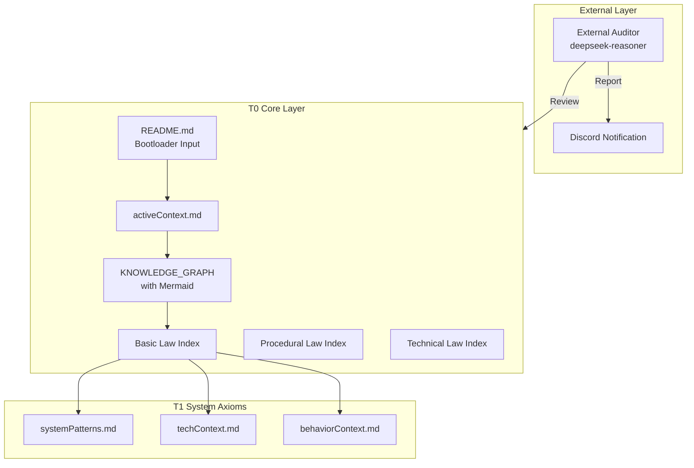

# Constitution-Driven Development Skill (CDD)

**Version**: 1.3.2  
**Codename**: Final Polish  
**License**: Apache-2.0  
**Author**: wsman

A comprehensive skill for OpenClaw that implements Constitution-Driven Development (CDD) methodology using MiniMax M2.1 model. External auditing with DeepSeek-Reasoner.

## Overview

CDD is a systematic approach to AI-assisted software development that enforces strict documentation-driven workflows, three-tier verification, and system entropy monitoring. It features a closed-loop architecture with external auditing capabilities.

## Features

- 📜 **T0/T1 Document System**: Core consciousness (T0) + System axioms (T1)
- 🔄 **Five-State Workflow**: A→B→C→D→E (Ingest → Plan → Execute → Verify → Converge)
- ✅ **Three-Tier Verification**: Structure → Signatures → Behavior
- 📊 **Entropy Monitoring**: Real-time $H_{sys}$ metrics with H_alignment
- 🎯 **System Entropy Calculation**: Python scripts for H_cog, H_struct, H_align
- 🤖 **External Auditor**: Third-party AI review with deepseek-reasoner
- 📋 **Knowledge Graph**: Mermaid visualization support
- 📐 **T1 Templates**: systemPatterns, techContext, behaviorContext

## Document Hierarchy

| Level | Name | Tokens | Description |
|-------|------|--------|-------------|
| **T0** | Core Consciousness | <800 | Must always be loaded (5 core documents) |
| **T1** | System Axioms | <200 | NEW: systemPatterns, techContext, behaviorContext |
| **T2** | Executable Standards | <100/task | Lazy loaded on demand (DS/WF files) |
| **T3** | Archives | 0 | Loaded only for audit |

## Architecture



## Core Workflow (Closed-Loop)

```
1. Load README.md (Bootloader Input - One-shot)
2. Load All 5 T0 Documents + 3 T1 Documents
3. Calculate H_sys (Entropy Baseline)
4. Execute CDD Five-State Workflow (A→B→C→D→E)
5. Detect T0 Changes
   ├─ No Change → Continue Development
   └─ Change → Trigger External Audit
6. External Audit (deepseek-reasoner, max_tokens=8192)
   ├─ Review T0 Documents
   ├─ Generate Report with real API data
   └─ Send to Discord
7. User Confirmation
8. Closed-Loop Verification (Tier 1/2/3)
9. Complete/Continue
```

## Quick Start

```bash
# Clone this skill to your OpenClaw skills directory
git clone https://github.com/wsman/Constitution-Driven-Development-Skill.git
cp -r Constitution-Driven-Development-Skill/ ../openclaw/skills/cdd/

# For a new project, create Memory Bank:
cd /path/to/your/project
mkdir -p memory_bank/00_indices
mkdir -p memory_bank/01_active_state
mkdir -p memory_bank/02_systemaxioms
mkdir -p memory_bank/03_protocols/workflows
mkdir -p memory_bank/03_protocols/standards

# Copy T0 templates
cp cdd/templates/*_index.md memory_bank/00_indices/
cp cdd/templates/activeContext.md memory_bank/01_active_state/
cp cdd/templates/KNOWLEDGE_GRAPH.md memory_bank/02_systemaxioms/

# Copy T1 templates (NEW v1.2.0)
cp cdd/templates/systemPatterns.md memory_bank/02_systemaxioms/
cp cdd/templates/techContext.md memory_bank/02_systemaxioms/
cp cdd/templates/behaviorContext.md memory_bank/02_systemaxioms/

# Create project README from template
cp cdd/templates/readme_template.md README.md
```

## Structure

```
cdd/
├── SKILL.md                         # Main skill file (v1.2.0, with Appendix A)
├── README.md                        # This file (v1.2.0)
├── templates/                       # T0/T1 document templates
│   ├── 01_basic_law_index.md        # Basic Law Index
│   ├── 02_procedural_law_index.md   # Procedural Law Index
│   ├── 03_technical_law_index.md    # Technical Law Index
│   ├── activeContext.md             # Active Context (v1.2.0)
│   ├── KNOWLEDGE_GRAPH.md           # Knowledge Graph (v1.2.0, Mermaid)
│   ├── systemPatterns.md            # T1: Architecture patterns (NEW)
│   ├── techContext.md               # T1: Interface signatures (NEW)
│   ├── behaviorContext.md           # T1: Behavior assertions (NEW)
│   ├── cdd_config.yaml              # CDD Configuration
│   ├── guide.md                     # Template Usage Guide
│   └── readme_template.md           # Project README Template
└── scripts/
    └── calculate_entropy.py         # Entropy calculation script (NEW)
```

## Core Mathematics (v1.2.0)

**System Entropy** (Updated with H_align):
$$
H_{sys} = 0.4 \cdot H_{cog} + 0.3 \cdot H_{struct} + 0.3 \cdot H_{align}
$$

Where:
- **H_cog** (Cognitive Load): $T_{load} / 8000$
- **H_struct** (Structural Entropy): $1 - N_{linked}/N_{total}$
- **H_align** (Alignment Deviation): $N_{violation} / N_{constraints}$ (NEW)

**Calibration Standard** (v1.2.0):
- 🟢 **Excellent**: $0.0 - 0.3$ (Calibration Target)
- 🟡 **Good**: $0.3 - 0.5$ (Normal Development)
- 🟠 **Warning**: $0.5 - 0.7$ (Start Repairs)
- 🔴 **Danger**: $0.7 - 1.0$ (Force Refactoring)

**Attention Distribution**:
$$
\text{Attention}(T0) \gg \text{Attention}(T1) > \text{Attention}(T2) \gg \text{Attention}(T3)
$$

## Usage

Use with OpenClaw + MiniMax M2.1 for development, DeepSeek-Reasoner for auditing:

```bash
# In OpenClaw
/cdd "Your development task description"
```

## CDD Workflow

1. **State A (Context Ingestion)**: Load T0 + T1 documents
2. **State B (Documentation First)**: Plan in T0/T1 docs, wait for approval
3. **State C (Safe Implementation)**: Execute code changes
4. **State D (Three-Tier Verification)**:
   - **Tier 1**: Structure ($S_{fs} \cong S_{doc}$) vs `systemPatterns.md`
   - **Tier 2**: Signatures ($I_{code} \supseteq I_{doc}$) vs `techContext.md`
   - **Tier 3**: Behavior ($B_{code} \equiv B_{spec}$) vs `behaviorContext.md`
5. **State E (Converge)**: Calibrate $H_{sys} \leq 0.3$, complete

## External Auditor (v1.2.0)

CDD includes an **External Auditor** for third-party AI review:

- **Trigger**: T0 document changes
- **Model**: deepseek-reasoner
- **Max Tokens**: 8192 (for complete audit output)
- **Scope**: T0 documents only
- **Output**: Markdown report with real API data → Discord notification

**API Data Requirement** (v1.2.0):
- Request ID, timestamps, latency (ms), token counts (exact, no estimates)

## Closed-Loop Verification Checklist

Before completing any task, verify:

| Check | Standard | Template |
|-------|----------|----------|
| Code ↔ Architecture Isomorphism | `code` ≅ `systemPatterns.md` | systemPatterns.md |
| Interface ↔ Signature Match | `interface` ⊇ `techContext.md` | techContext.md |
| Behavior ↔ Assertion Consistency | `behavior` ≡ `behaviorContext.md` | behaviorContext.md |
| T0 Documents Synced | All 5 T0 docs updated | - |
| Entropy Calibrated | $H_{sys} \leq 0.3$ | activeContext.md |
| External Audit Passed | (If T0 changed) | Audit Report |

## References

- See `SKILL.md` Appendix A for entropy calculation scripts
- See `templates/guide.md` for template usage guide
- See `templates/KNOWLEDGE_GRAPH.md` for Mermaid visualization examples
- See `templates/systemPatterns.md` for Tier 1 verification template
- See `templates/techContext.md` for Tier 2 verification template
- See `templates/behaviorContext.md` for Tier 3 verification template

## License

Licensed under the Apache License, Version 2.0. See LICENSE file for details.
