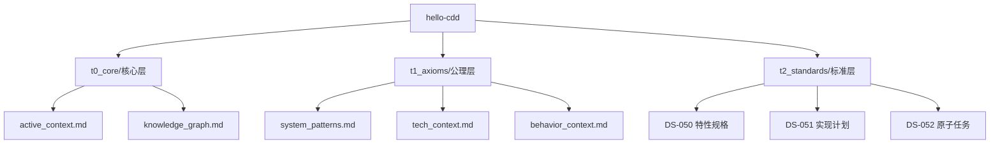

# Knowledge Graph (知识图谱)

**项目**: hello-cdd  
**版本**: v0.1.0

---

## 📊 概念关系图



---

## 🔗 文件依赖关系

| 源文件 | 依赖 | 目标文件 |
|--------|------|----------|
| `active_context.md` | → | `knowledge_graph.md` |
| `DS-050` | → | `system_patterns.md` |
| `DS-051` | → | `tech_context.md` |
| `DS-052` | → | `behavior_context.md` |

---

## 📁 项目结构

```
hello-cdd/
├── memory_bank/
│   ├── t0_core/           # 核心层 - 必须加载
│   │   ├── active_context.md
│   │   └── knowledge_graph.md
│   ├── t1_axioms/         # 公理层 - 架构约束
│   │   ├── system_patterns.md
│   │   ├── tech_context.md
│   │   └── behavior_context.md
│   └── t2_standards/      # 标准层 - 实现规范
│       ├── DS-050_feature_specification.md
│       ├── DS-051_implementation_plan.md
│       └── DS-052_atomic_tasks.md
├── specs/                 # 生成的特性规格
├── src/                   # 源代码
└── tests/                 # 测试代码
```

---

## 🏷️ 关键概念

| 概念 | 定义 | 文档位置 |
|------|------|----------|
| **Memory Bank** | 项目的唯一真理源 | `memory_bank/` |
| **5状态工作流** | A→B→C→D→E 开发流程 | `active_context.md` |
| **熵值** | 系统混乱度指标 | `active_context.md` |
| **宪法审计** | Gate 1-4 验证 | `cdd_audit.py` |