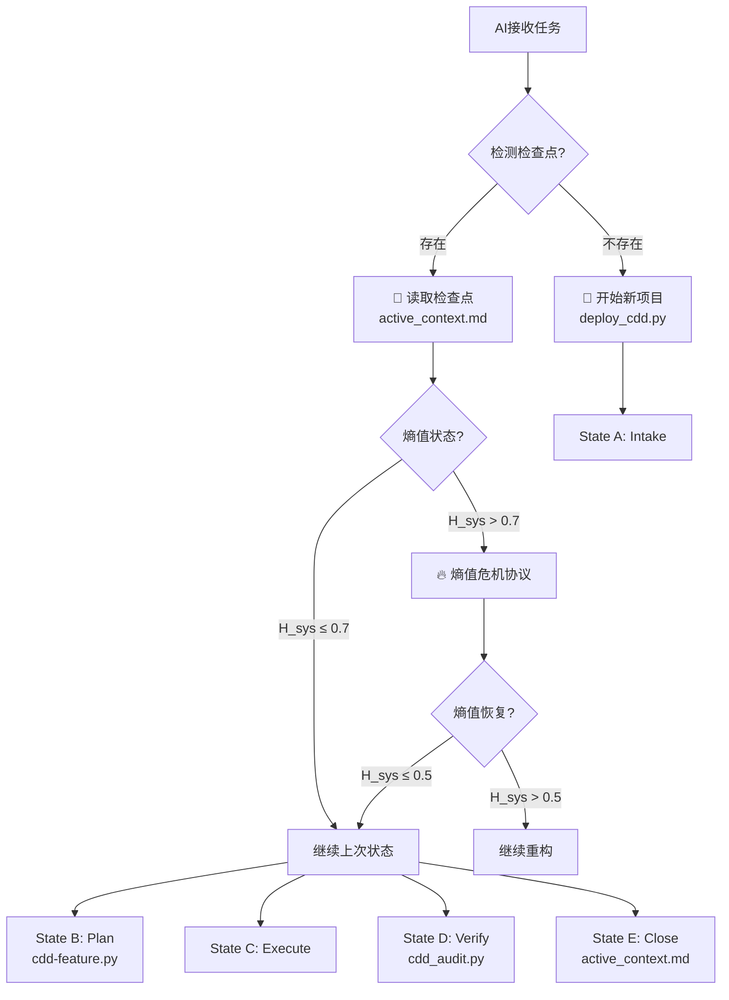

# CDD Architecture & Legal Framework

**Version**: v1.6.1
**Type**: T0 (System Axiom)
**Purpose**: Defines the immutable laws, architectural layers, and entropy metrics of the CDD system.

---

## 🏛️ I. The Legal Framework (宪法体系)

CDD 系统依据以下三类法典运行。所有开发行为必须符合法典约束。

### §100 Basic Law (基本法 - 核心公理)
* **§102.3 Synchronization Axiom**: 代码 ($C$) 与文档 ($D$) 必须原子性同步。$\Delta C \neq 0 \implies \Delta D \neq 0$。
* **§152 Single Source of Truth**: `memory_bank/` 是唯一真理源。严禁在多个位置维护同一状态。
* **§201.5 Entropy Reduction**: 所有变更必须证明其有助于降低或维持系统熵值 ($H_{sys}$)。$\Delta H_{sys} \le 0$。

### §300 Technical Law (技术法 - 实现约束)
* **§300.1 Spore Protocol**: CDD Skill 是一个附着于宿主项目 (`TARGET_ROOT`) 的独立孢子。严禁污染宿主业务逻辑。通过数学隔离约束实现：$S_{tool} \cap S_{target} = \varnothing$，其中 $S_{tool}$ 是CDD工具集，$S_{target}$ 是目标项目集。
* **§315 Isomorphism Principle**: 文件系统结构 ($S_{fs}$) 必须与文档定义的架构 ($S_{doc}$) 同构。$S_{fs} \cong S_{doc}$。

---

## 🏗️ II. The T0-T3 Document Hierarchy (架构分层)

为了优化 Agent 的 **Context Window ($H_{cog}$)**，CDD 采用四级加载策略。

| Tier | Name | Token Cost | Role | Loading Policy |
|:---:|:---|:---:|:---|:---|
| **T0** | **Kernel** (Consciousness) | < 800 | 身份、当前状态、导航图谱 | **Always Resident** |
| **T1** | **Axioms** (Physics) | < 2000 | 架构模式、接口签名、行为公理 | **On-Demand** (Arch Check) |
| **T2** | **Standards** (Legislation) | < 500/file | 特性规范、实施计划、任务清单 | **Lazy Load** (Task Execution) |
| **T3** | **Archives** (History) | 0 | 审计日志、历史版本 | **Audit Only** |

### 核心文件映射
* **T0**: `memory_bank/core/active_context.md` (State), `knowledge_graph.md` (Relationships)
* **Meta**: `SKILL.md` (Project Overview & Agent Directives)
* **T1**: `memory_bank/axioms/system_patterns.md` (Topology), `tech_context.md` (Signatures)
* **T2**: `memory_bank/standards/DS-*` (Templates)

---

## 📉 III. System Entropy Metrics ($H_{sys}$)

系统熵值是衡量软件腐化的核心指标。

$$H_{sys} = w_1 \cdot H_{cog} + w_2 \cdot H_{struct} + w_3 \cdot H_{align}$$

### 1. Metric Definitions
* **$H_{cog}$ (Cognitive Load)**: 上下文污染度。
    * Formula: $Tokens_{loaded} / Tokens_{limit}$
    * Goal: $< 0.4$
* **$H_{struct}$ (Structural Entropy)**: 文件组织混乱度。
    * Formula: $1 - (N_{indexed\_files} / N_{total\_files})$
    * Goal: $< 0.1$ (All files must be indexed)
* **$H_{align}$ (Alignment Deviation)**: 实现与规范的偏离度。
    * Formula: $1 - (Sig_{matched} / Sig_{total})$
    * Goal: $0.0$ (Strict Isomorphism)

### 2. Thresholds (v1.6.1 Calibrated)
* 🟢 **Green ($0.0 - 0.3$)**: Healthy. Allow feature development.
* 🟡 **Yellow ($0.3 - 0.7$)**: Debt accumulation. Refactor recommended.
* 🔴 **Red ($> 0.7$)**: Critical state. **STOP** all feature work. Initiate `Refactoring Protocol`.

---

## ⚖️ IV. Three-Tier Verification (司法验证)

任何状态变更 (State C $\to$ D) 必须通过三级验证：

1.  **Tier 1 (Structural)**: `tree src/` matches `system_patterns.md`.
2.  **Tier 2 (Signature)**: Code symbols match `tech_context.md`.
3.  **Tier 3 (Behavioral)**: Tests pass and satisfy `behavior_context.md` invariants.

> **Tooling**: Use `scripts/cdd_audit.py` to enforce these gates automatically.

---

## 🔧 V. Toolchain & Workflow Integration (工具链与工作流集成)

### 1. Complete Toolchain Architecture (完整工具链架构)

CDD v1.6.1 工具链包含 **6个核心脚本** 和 **2个工具库模块**，严格遵循宪法条款设计：

| 工具 | 版本 | 宪法依据 | 核心功能 | 使用时机 |
|------|------|----------|----------|----------|
| `deploy_cdd.py` | v2.0.1 | §102.3 同步公理 §300.1 孢子协议 | 孢子部署，初始化Memory Bank 严格孢子隔离 | **开始新项目** (State A之前) |
| `cdd-feature.py` | v2.1.2 | §141 状态机公理 §300.1 孢子协议 | 特性脚手架，生成T2 Specs 防止CDD技能污染 | **状态A→B转换** |
| `cdd_audit.py` | v1.0 | §201.3 三阶验证公理 | 宪法审计，运行Gate 1-3 | **状态C→D转换** |
| `measure_entropy.py` | v1.4.1 | §201.5 熵减公理 §300.1 孢子协议 | 熵值计量，计算$H_{sys}$ 智能孢子隔离 | **监控系统健康** |
| `verify_versions.py` | v1.7.1 | §102.3 同步公理 §300.1 孢子协议 | 版本同步，检查和修复一致性 智能孢子隔离 | **修复版本漂移** |

**工具库模块**：
- `spore_guard.py`：孢子隔离协议实施（宪法§300.1）
- `cache_manager.py`：熵值计算缓存管理（性能优化）
- `command_utils.py`：CLI执行工具库（标准化接口）

### 2. Enhanced 5-State Workflow (增强五状态工作流)

基于 **§141 状态机公理**，CDD工作流现已增强以下关键能力：

#### 🔄 State Transitions with Tools (工具驱动的状态转换)
| 状态转换 | 必需工具 | 宪法依据 | 标准化场景 |
|----------|----------|----------|------------|
| **A→B (Intake→Plan)** | `cdd-feature.py` | §141 | 🔄 状态A→B转换 |
| **B→C (Plan→Execute)** | 手动实现 | §152 | ⚡ 状态B→C转换 |
| **C→D (Execute→Verify)** | `cdd_audit.py` | §201.3 | ✅ 状态C→D转换 |
| **D→E (Verify→Close)** | `active_context.md`更新 | §125 | 🔒 状态D→E转换 |

#### 🔥 Entropy Crisis Protocol (熵值危机协议)
当 $H_{sys} > 0.7$ 时，基于 **§201.5 熵减公理** 触发：
1. **立即停止**：停止所有新功能开发
2. **强制重构**：执行`WF-206_refactor_protocol.md`（如可用）
3. **优先级调整**：技术债务修复优先于业务功能
4. **恢复标准**：$H_{sys} \le 0.5$ 后才能继续新功能

**重构优先级**：
| 优先级 | 重构目标 | 预期熵值降低 | 宪法依据 |
|--------|----------|--------------|----------|
| **P0** | 修复 Tier 1 结构违反 | $\Delta H_{struct} \approx -0.2$ | §201.3 Tier 1 |
| **P1** | 修复 Tier 2 签名缺失 | $\Delta H_{align} \approx -0.15$ | §201.3 Tier 2 |
| **P2** | 修复 Tier 3 行为失败 | $\Delta H_{cog} \approx -0.1$ | §201.3 Tier 3 |
| **P3** | 清理未使用代码 | $\Delta H_{sys} \approx -0.05$ | §201.5 |

#### 📍 Checkpoint Recovery Mechanism (检查点恢复机制)
基于 **§125 持久性公理**，CDD支持从 `active_context.md` 恢复开发：

**检查点检测流程**：
1. 检测 `memory_bank/core/active_context.md` 是否存在
2. 解析"引导加载状态"表格中的工作流状态
3. 根据状态继续相应的工作流

**恢复决策表**：
| 检查点状态 | 恢复操作 | 参考文档 | 宪法依据 |
|------------|----------|----------|----------|
| **State B (Plan)** | 检查DS-050是否批准 | `04_core_workflow.md` | §141 |
| **State C (Execute)** | 继续编码实现 | `tech_context.md` | §152 |
| **State D (Verify)** | 运行`cdd_audit.py` | `03_toolchain.md` | §201.3 |
| **熵值危机** | 优先执行熵值危机协议 | 本节内容 | §201.5 |

### 3. Standardized Scenarios for AI Agents (AI代理标准化场景)

CDD定义 **14个标准化场景**，为AI代理提供完整操作剧本：

**工作流状态转换** (4个)：
- 🔄 状态A→B转换、⚡ 状态B→C转换、✅ 状态C→D转换、🔒 状态D→E转换

**项目生命周期** (3个)：
- 🚀 开始新项目、📍 从检查点继续、🛠️ 创建新特性

**验证与维护** (4个)：
- 🛡️ 运行宪法审计、📊 测量系统熵值、🔧 修复版本漂移、🔨 验证失败修复

**紧急处理** (2个)：
- 🔥 熵值过高强制重构、🔄 版本冲突解决

**通用帮助** (1个)：
- 🤔 不确定使用方式

### 4. Integrated Decision Flow (集成决策流程)

### 5. Constitutional Synergy Matrix (宪法协同矩阵)

| 宪法条款 | 工具实现 | 工作流状态 | 标准化场景 | 熵值影响 |
|----------|----------|------------|------------|----------|
| **§102.3** | `verify_versions.py` | Gate 1检查 | 🔧 修复版本漂移 | $\Delta H_{align} \downarrow$ |
| **§141** | `cdd-feature.py` | State A→B转换 | 🔄 状态A→B转换 | $\Delta H_{cog} \uparrow$ (临时) |
| **§152** | 手动实现 | State B→C转换 | ⚡ 状态B→C转换 | $\Delta H_{struct} \downarrow$ |
| **§201.3** | `cdd_audit.py` | State C→D转换 | ✅ 状态C→D转换 | $\Delta H_{align} \downarrow$ |
| **§201.5** | `measure_entropy.py` | 熵值监控 | 🔥 熵值过高强制重构 | $\Delta H_{sys} \downarrow$ |
| **§125** | `active_context.md` | 检查点恢复 | 📍 从检查点继续 | $\Delta H_{cog} \downarrow$ |

**宪法公理**：工具链、工作流和场景的集成体现了 **§102.3 同步公理**（所有组件必须同步更新）和 **§141 状态机公理**（操作必须遵循明确的工作流）。

---
**版本记录**: 此集成基于 v1.6.1 的 `03_toolchain.md` 和 `04_core_workflow.md` 增强，更新日期：2026-02-03
