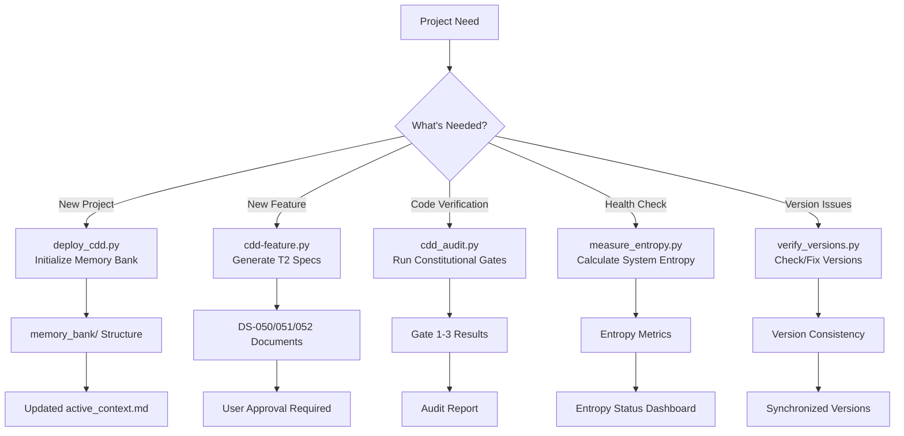

# 03_Toolchain: CLI & Configuration

**Type**: T1 (Technical Reference)
**Purpose**: Comprehensive guide to the CDD Python scripts, configuration, and usage scenarios.

## 🛠️ Complete Tool Directory

### 1. Project Initialization Tools

#### `deploy_cdd.py` (The Spore Deployer) v2.0
Deploys CDD Memory Bank structure to target projects using **Spore Protocol (Seed→Root→Sprout)**.
* **Usage**: `python scripts/deploy_cdd.py "Project Name" [--target <path>] [--force]`
* **Function**:
    1. Creates complete `memory_bank/` directory structure: `core/`, `axioms/`, `protocols/`, `standards/`
    2. Copies all T0-T2 templates with proper placeholder replacement
    3. Initializes `active_context.md` with project metadata
* **Use Cases**:
    - **Start New Project**: Initialize Memory Bank for a new project
    - **Migrate Existing**: Add CDD structure to legacy projects
* **Key Parameters**:
    - `--target`: Target directory (default: current directory)
    - `--force`: Overwrite existing files (use with caution)
* **Constitutional Basis**: §102.3 Synchronization Axiom

### 2. Development Phase Tools

#### `cdd-feature.py` (The Scaffolder) v2.1.0
Generates T2 documentation skeletons based on templates.
* **Usage**: `python scripts/cdd-feature.py "feature_name" [description] [--target <path>] [--no-branch]`
* **Function**:
    1. Reads templates from `templates/04_standards/` (Source).
    2. Creates `specs/{ID}-{name}/` directory in target project.
    3. Generates DS-050 (spec), DS-051 (plan), DS-052 (tasks), and a feature README.
    4. Optionally creates a Git branch with the feature name.
* **Use Cases**:
    - **State A→B Transition**: Generate T2 Specs during planning phase
    - **New Feature Development**: Create standardized feature documentation
* **Key Parameters**:
    - `--target`: Target project directory (default: current directory)
    - `--no-branch`: Skip git branch creation
* **Constitutional Basis**: §141 State Machine Axiom

### 3. Verification Phase Tools

#### `cdd_audit.py` (The Judge) v1.0
Enforces the Legal Framework (§100-§300) through automated constitutional gates.
* **Usage**: `python scripts/cdd_audit.py --gate [1|2|3|all] [--format json/text] [--ai-hint]`
* **Gates**:
    * **Gate 1 (Version Consistency)**: Checks version alignment across all CDD files using `scripts/verify_versions.py`.
    * **Gate 2 (Behavior Verification)**: Runs `pytest` to verify test compliance (Tier 3).
    * **Gate 3 (Entropy Monitoring)**: Calculates system entropy ($H_{sys}$) using `scripts/measure_entropy.py`.
* **Use Cases**:
    - **State C→D Transition**: Verify code implementation before closing
    - **Regular Audits**: Periodic constitutional compliance checks
    - **Pre-commit Validation**: Ensure changes meet constitutional standards
* **Key Parameters**:
    - `--gate`: Specify which gate(s) to run (1, 2, 3, or all)
    - `--format`: Output format (json/text)
    - `--ai-hint`: Provide AI-friendly hints for self-healing
* **Constitutional Basis**: §201.3 Three-Tier Verification Axiom

#### `measure_entropy.py` (The Meter) v1.4.0
Calculates the system entropy score ($H_{sys}$) with detailed breakdown.
* **Usage**: `python scripts/measure_entropy.py [--project <path>] [--json] [--verbose] [--force-recalculate]`
* **Output**: JSON report with $H_{cog}$, $H_{struct}$, $H_{align}$, and overall $H_{sys}$
* **Function**:
    1. Calculates cognitive load ($H_{cog}$): $T_{load} / 8000$
    2. Calculates structural entropy ($H_{struct}$): $1 - N_{linked}/N_{total}$
    3. Calculates alignment deviation ($H_{align}$): $N_{violation} / N_{constraints}$
    4. Computes weighted sum: $H_{sys} = 0.4H_{cog} + 0.3H_{struct} + 0.3H_{align}$
* **Use Cases**:
    - **Entropy Monitoring**: Regular system health checks
    - **Crisis Detection**: Identify when $H_{sys} > 0.7$ (danger state)
    - **Refactoring Validation**: Measure entropy reduction after refactoring
* **Key Parameters**:
    - `--project`: Target project path (default: current directory)
    - `--json`: JSON format output for programmatic consumption
    - `--force-recalculate`: Ignore cache and recalculate entropy
* **Constitutional Basis**: §201.5 Entropy Reduction Axiom

### 4. Maintenance Phase Tools

#### `verify_versions.py` (The Synchronizer) v1.7.0
Ensures version consistency across all CDD files and can automatically fix discrepancies.
* **Usage**: `python scripts/verify_versions.py [--fix] [--project <path>] [--target-version X.Y.Z]`
* **Function**:
    1. Scans all CDD-related files for version markers
    2. Detects version inconsistencies
    3. Can automatically fix inconsistencies with `--fix` flag
    4. Supports bulk version updates with `--target-version`
* **Use Cases**:
    - **Gate 1 Enforcement**: Version consistency checking
    - **Version Drift Repair**: Fix accidental version mismatches
    - **Bulk Updates**: Update all files to a new target version
* **Key Parameters**:
    - `--fix`: Automatically fix version inconsistencies
    - `--project`: Target project directory
    - `--target-version`: Specify target version for bulk updates
* **Constitutional Basis**: §102.3 Synchronization Axiom

### 5. Utility Modules (`scripts/utils/`)

#### `cache_manager.py`
Manages entropy calculation caching to improve performance.
* **Purpose**: Cache entropy calculations to avoid redundant computations
* **Features**: LRU cache, cache invalidation, persistence
* **Used By**: `measure_entropy.py`

#### `command_utils.py`
Common CLI execution utilities for consistent command handling.
* **Purpose**: Standardize CLI execution across all scripts
* **Features**: Command execution, error handling, output parsing
* **Used By**: All main scripts

## 🎯 Tool Usage Timing Matrix

| Tool | When to Use | Workflow State | Standardized Scenario | Key Actions |
|------|-------------|----------------|----------------------|-------------|
| `deploy_cdd.py` | **Start New Project** | Before State A | 🚀 开始新项目 | Initialize Memory Bank |
| `cdd-feature.py` | **Plan New Feature** | State A→B | 🔄 状态A→B转换 | Generate T2 Specs |
| `cdd_audit.py` | **Verify Implementation** | State C→D | ✅ 状态C→D转换 | Run Gates 1-3 |
| `measure_entropy.py` | **Monitor System Health** | Any State | 📊 测量系统熵值 | Calculate $H_{sys}$ |
| `verify_versions.py` | **Fix Version Issues** | Any State | 🔧 修复版本漂移 | Check/Fix versions |

## 🔄 Tool Relationship Diagram



## ⚙️ Configuration (`cdd_config.yaml`)

Located at project root (or `templates/` for default configuration).

### Core Configuration
* **`project_name`**: Target project identifier (used in placeholders).
* **`llm_model`**: Model used for generation (e.g., "minimax/MiniMax-M2.1").
* **`entropy_thresholds`**: Custom limits for entropy states:
  ```yaml
  entropy_thresholds:
    excellent: 0.3    # 🟢
    good: 0.5         # 🟡
    warning: 0.7      # 🟠
    danger: 1.0       # 🔴
  ```

### Hooks Configuration
* **`hooks`**: External validation hooks for extensibility:
  ```yaml
  hooks:
    pre_audit: "path/to/pre_audit_script.sh"
    post_audit: "path/to/post_audit_script.py"
    entropy_crisis: "path/to/crisis_handler.py"
  ```

## 🔌 External Auditor Interface

CDD supports external validation hooks for third-party integration.
* **Interface**: Any executable returning standard exit codes (0=Pass, 1=Fail)
* **Integration**: Add script path to `cdd_config.yaml` under `hooks`
* **Use Cases**:
  - DeepSeek-Reasoner integration for external AI audit
  - Custom validation logic specific to organization
  - Integration with existing CI/CD pipelines

## 📋 Usage Examples

### Example 1: Complete Feature Development Cycle
```bash
# 1. Start new project (if needed)
python scripts/deploy_cdd.py "MyApp" --target ../my-app

# 2. Generate feature documentation
python scripts/cdd-feature.py "User Authentication" --target ../my-app

# 3. Wait for user approval of DS-050...

# 4. Implement code (manually)

# 5. Verify implementation
python scripts/cdd_audit.py --gate all --target ../my-app

# 6. Monitor entropy
python scripts/measure_entropy.py --project ../my-app --json
```

### Example 2: Emergency Response - Entropy Crisis
```bash
# 1. Detect entropy crisis
python scripts/measure_entropy.py --json
# Output: {"h_sys": 0.72, "status": "🔴 危险"}

# 2. Stop new features, prioritize refactoring
# 3. After refactoring, verify entropy improvement
python scripts/measure_entropy.py --force-recalculate
# Output: {"h_sys": 0.45, "status": "🟡 良好"}
```

### Example 3: Automated Version Management
```bash
# 1. Check version consistency
python scripts/verify_versions.py --project ../my-app

# 2. If inconsistencies found, fix them
python scripts/verify_versions.py --fix --project ../my-app

# 3. Bulk update to new version
python scripts/verify_versions.py --fix --project ../my-app --target-version 1.6.2
```

**Constitutional Note**: All tools must be run with explicit `--target` or `--project` parameters when operating on external projects to prevent accidental modification of CDD skill repository itself.
