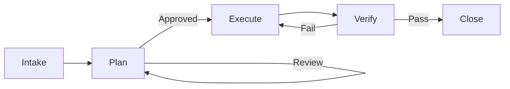
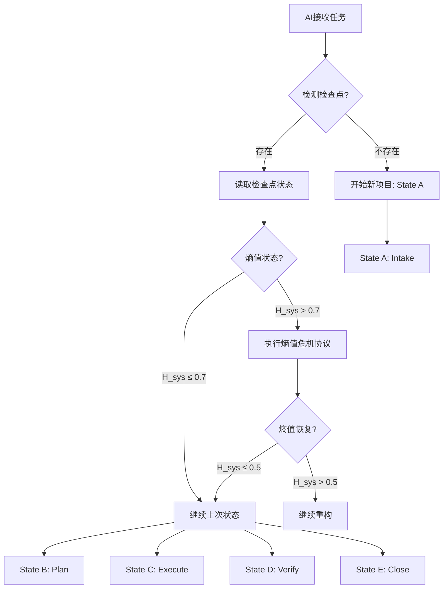

# 04_Core_Workflow: The 5-State Engine

**Type**: T1 (Process)
**Purpose**: Defines the rigid state machine for feature development.

## The State Machine



### State A: Intake (Start)

* **Input**: User prompt / Issue.
* **Action**: Load `active_context.md`. Verify .
* **Output**: Clear intent.

### State B: Plan (Documentation)

* **Input**: Intent.
* **Action**: Run `cdd-feature.py`. Fill `DS-050` (Spec) & `DS-051` (Plan).
* **Constraint**: **NO CODE** is written here.
* **Exit Condition**: User approval of documents.

### State C: Execute (Implementation)

* **Input**: Approved T2 Specs.
* **Action**: Write `src/` code and `tests/`.
* **Constraint**: Must follow `tech_context.md` patterns.

### State D: Verify (Audit)

* **Input**: New Code.
* **Action**: Run `cdd_audit.py`.
* **Exit Condition**: All Gates Pass.

### State E: Close (Commit)

* **Action**: Update `active_context.md` to reflect completed work.
* **Output**: Git Commit.

## 🔄 State Transitions (场景转换)

每个状态转换都有明确的触发条件、必需操作和验证检查。**AI代理必须严格按照此顺序执行**。

### A→B: Intake → Plan
**触发条件**: 用户意图明确，`active_context.md` 已加载，$H_{sys} \le 0.7$
**必需操作**:
1. 运行 `cdd-feature.py "Feature Name"`
2. 生成 `DS-050_feature_specification.md` 和 `DS-051_implementation_plan.md`
3. 等待用户批准
**验证检查**:
- ✅ 检查点存在 (`memory_bank/core/active_context.md`)
- ✅ 熵值状态正常 ($H_{sys} \le 0.7$)
- ✅ T2 Spec 模板可用
**宪法依据**: §141 状态机公理

### B→C: Plan → Execute  
**触发条件**: T2 Spec (DS-050) 获得用户批准
**必需操作**:
1. 读取批准的 `DS-050_feature_specification.md`
2. 创建对应的 `src/` 文件和 `tests/` 测试
3. 遵循 `tech_context.md` 中的接口签名
**验证检查**:
- ✅ DS-050 已批准 (用户明确确认)
- ✅ 代码结构符合 `system_patterns.md`
- ✅ 接口签名匹配 `tech_context.md`
**宪法依据**: §152 单一真理源公理

### C→D: Execute → Verify
**触发条件**: 所有代码实现完成，通过本地测试
**必需操作**:
1. 运行 `cdd_audit.py` (或 `make audit`)
2. 检查 Gate 1-3 全部通过
3. 如有失败，返回State C修复
**验证检查**:
- ✅ 代码编译/解释通过
- ✅ 本地测试通过 (`pytest`)
- ✅ Tier 1-3 验证准备就绪
**宪法依据**: §201.3 三阶验证公理

### D→E: Verify → Close
**触发条件**: `cdd_audit.py` 报告所有Gate通过
**必需操作**:
1. 更新 `active_context.md` 中的"最近宪法事件"
2. 更新熵值状态 (如果变化)
3. 提交Git提交，包含代码和文档
**验证检查**:
- ✅ Gate 1-3 全部通过
- ✅ `active_context.md` 更新成功
- ✅ Git提交包含所有相关文件
**宪法依据**: §125 持久性公理

## 🔥 Entropy Crisis Protocol (熵值危机协议)

当系统熵值 $H_{sys} > 0.7$ 时，触发**熵值危机协议**。基于 **§201.5 熵减公理**，系统必须优先降低熵值。

### 危机检测
```bash
# 检测熵值状态
python scripts/measure_entropy.py --json

# 如果输出显示 H_sys > 0.7，触发危机协议
{
  "h_sys": 0.72,
  "status": "🔴 危险",
  "timestamp": "2026-02-03T18:40:00Z"
}
```

### 危机响应流程
1. **立即停止**: 停止所有新功能开发，无论处于哪个状态
2. **强制重构**: 执行 `WF-206_refactor_protocol.md` (如可用) 或手动重构
3. **优先级调整**: 技术债务修复优先于业务功能
4. **监控恢复**: 持续测量熵值，直到 $H_{sys} \le 0.5$

### 重构优先级
| 优先级 | 重构目标 | 预期熵值降低 |
|--------|----------|--------------|
| **P0** | 修复 Tier 1 结构违反 (vs `system_patterns.md`) | $\Delta H_{struct} \approx -0.2$ |
| **P1** | 修复 Tier 2 签名缺失 (vs `tech_context.md`) | $\Delta H_{align} \approx -0.15$ |
| **P2** | 修复 Tier 3 行为失败 (vs `behavior_context.md`) | $\Delta H_{cog} \approx -0.1$ |
| **P3** | 清理未使用代码和文档 | $\Delta H_{sys} \approx -0.05$ |

### 恢复标准
- **临时恢复**: $H_{sys} \le 0.7$ (可恢复有限的新功能)
- **完全恢复**: $H_{sys} \le 0.5$ (恢复正常开发)
- **目标状态**: $H_{sys} \le 0.3$ (优秀状态)

## 📍 Checkpoint Recovery (检查点恢复)

CDD工作流支持从 `active_context.md` 中的检查点恢复开发。

### 检查点检测流程
1. **检测文件**: 检查 `memory_bank/core/active_context.md` 是否存在
2. **读取状态**: 解析"引导加载状态"表格中的工作流状态
3. **确定位置**: 根据状态继续相应的工作流

### 恢复决策表
| 检查点状态 | 恢复操作 | 参考文档 |
|------------|----------|----------|
| **State B (Plan)** | 检查DS-050是否批准，等待或继续生成 | `DS-050_feature_specification.md` |
| **State C (Execute)** | 继续编码实现已批准的DS-050 | `tech_context.md` |
| **State D (Verify)** | 运行 `cdd_audit.py` 完成验证 | `03_toolchain.md` |
| **State E (Close)** | 更新 `active_context.md` 完成闭环 | `active_context.md` 模板 |
| **熵值危机** | 优先执行熵值危机协议 | 本节内容 |

### 特殊处理
- **检查点不存在**: 按"开始新项目"流程，进入State A
- **检查点损坏**: 使用 `verify_versions.py --fix` 尝试修复
- **版本不匹配**: 检查版本一致性，必要时回滚

## 🎯 Standardized Scenarios (标准化场景)

将常见AI任务映射到工作流状态和操作：

| 场景 | 工作流状态 | 关键操作 | 目标文档 |
|------|------------|----------|----------|
| **开始新项目** | State A | 运行 `deploy_cdd.py` | `memory_bank/core/` |
| **从检查点继续** | 上次停止状态 | 读取 `active_context.md` | 无 |
| **状态A→B转换** | A→B | 生成DS-050规范 | `DS-050_feature_specification.md` |
| **状态B→C转换** | B→C | 开始编码实现 | `src/` + `tests/` |
| **状态C→D转换** | C→D | 运行完整审计 | `cdd_audit.py` |
| **状态D→E转换** | D→E | 更新活动上下文 | `active_context.md` |
| **熵值过高重构** | 紧急状态 | 停止新功能，执行重构 | `WF-206_refactor_protocol.md` |
| **验证失败修复** | State C/D | 根据失败Tier修复 | 对应验证模板 |
| **版本冲突解决** | 任何状态 | 运行 `verify_versions.py --fix` | `verify_versions.py` |

### 场景执行流程


**宪法依据**: §100 宪法总纲 - 所有操作必须遵循明确的工作流和验证标准。
