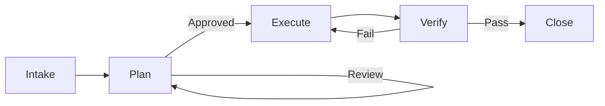

# 04_Core_Workflow: The 5-State Engine

**Type**: T1 (Process)
**Purpose**: Defines the rigid state machine for feature development.

## The State Machine

### State A: Intake (Start)

* **Input**: User prompt / Issue.
* **Action**: Load `active_context.md`. Verify .
* **Output**: Clear intent.

### State B: Plan (Documentation)

* **Input**: Intent.
* **Action**: Run `cdd-feature.py`. Fill `DS-050` (Spec) & `DS-051` (Plan).
* **Constraint**: **NO CODE** is written here.
* **Exit Condition**: User approval of documents.

### State C: Execute (Implementation)

* **Input**: Approved T2 Specs.
* **Action**: Write `src/` code and `tests/`.
* **Constraint**: Must follow `tech_context.md` patterns.

### State D: Verify (Audit)

* **Input**: New Code.
* **Action**: Run `cdd_audit.py`.
* **Exit Condition**: All Gates Pass.

### State E: Close (Commit)

* **Action**: Update `active_context.md` to reflect completed work.
* **Output**: Git Commit.