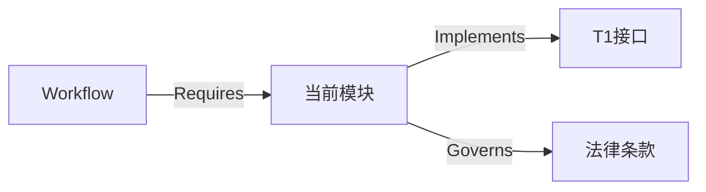

# 知识图谱 (Knowledge Graph)

**版本**: v1.6.0
**状态**: 🟢 活跃
**说明**: 项目知识图谱入口，提供高维关联导航
**维护机制**: 每次 CDD 周期结束时更新

---

## 1. 核心拓扑 (Core Topology)

```
┌─────────────────────────────────────────────────────┐
│                    Bootloader Kernel                │
│        (基本法索引 + 程序法索引 + 技术法索引)         │
└─────────────────────────────────────────────────────┘
                          │
        ┌─────────────────┼─────────────────┐
        ↓                 ↓                 ↓
┌───────────────┐ ┌───────────────┐ ┌───────────────┐
│   基本法       │ │   程序法       │ │   技术法       │
│  (LAW-BASIC)  │ │ (LAW-PROC)    │ │ (LAW-TECH)    │
└───────────────┘ └───────────────┘ └───────────────┘
        │                 │                 │
        └─────────────────┼─────────────────┘
                          ↓
┌─────────────────────────────────────────────────────┐
│                   领域知识簇                         │
│  安全与合规 | 核心架构 | I/O通信 | 认知范式          │
└─────────────────────────────────────────────────────┘
                          │
                          ↓
┌─────────────────────────────────────────────────────┐
│                   标准与工作流                        │
│        DS-xxx 标准 + WF-xxx 工作流                   │
└─────────────────────────────────────────────────────┘
```

## 2. 领域知识簇 (Domain Clusters)

### 🛡️ 安全与合规 (Security & Compliance)

| 项目 | 内容 |
|------|------|
| **中心节点** | 基本法 §100, 技术法 §310, 基本法 §156 |
| **核心标准** | DS-005 (重构安全), DS-006 (三阶段审计), DS-016 (编码安全) |
| **关联工作流** | WF-210 (安全操作), WF-207 (文件审查), WF-201 (CDD) |
| **防御网络** | DS-005 → 关联 DS-024 + DS-006 → 完整方案 |

**导航示例**:
> 重构安全: DS-005 → 关联 DS-024 (架构同步) + DS-006 (审计) → 完整方案
> 编码问题: DS-016 → 关联 DS-001 (UTF-8) + DS-002 (原子写入) → 安全I/O方案
> 安全审计: DS-006 → 验证 DS-027 (同构) + DS-007 (架构) → 审计报告

### ⚙️ 核心架构 (Core Architecture)

| 项目 | 内容 |
|------|------|
| **中心节点** | Bootloader Mode, System Patterns |
| **核心标准** | DS-024 (架构同步), DS-007 (架构验证), DS-023 (双存储映射) |
| **概念关联** | 熵减 → 双存储 → 单一真理源 |

### 🔌 输入输出与通信 (I/O & Comm)

| 项目 | 内容 |
|------|------|
| **中心节点** | 技术法 §300 |
| **核心标准** | DS-001 (UTF-8), DS-002 (原子写入), DS-003 (弹性通信) |

### 🧠 认知范式 (Cognitive Paradigm)

| 项目 | 内容 |
|------|------|
| **中心节点** | Bootloader Mode v1.3.2 |
| **核心概念** | 索引驱动、图谱导航、架构优先 |
| **导航示例** | 开发问题 → 索引查找 → 图谱推理 → 标准执行 → 熵减验证 |

## 3. 节点关系类型

| 关系 | 含义 | 示例 |
|------|------|------|
| **Implements** | 溯源至宪法条款 | DS-007 → §352 |
| **Related_to** | 横向扩展 | DS-005 → DS-024 |
| **Required_by** | 纵向深入 | DS-007 → WF-201 |
| **Governs** | 层级管辖 | 基本法 → 程序法 |
| **Defines** | 定义关系 | 程序法 → 工作流 |
| **Mandates** | 强制要求 | 技术法 → DS标准 |

## 4. 图谱导航协议 (Navigation Protocol)

### 模糊问题处理流程

当遇到模糊问题时（如"如何保证系统稳定性？"）：

1. **定位锚点**: 在领域知识簇中找到最接近的入口
2. **遍历邻居**: 检查该簇下的核心标准和关联工作流
3. **多跳推理**: 如果无法解决，检查 Related_To 边指向的节点

### 导航约束

- **最大跳数**: 3 跳
- **惰性加载**: 仅当需要时读取节点内容
- **索引优先**: 浏览关系时只读取索引

### 导航示例

> **问题**: "如何保证系统稳定性？"
> **路径**:
> 1. **定位**: 核心架构簇 (Core Architecture)
> 2. **遍历**: 发现 DS-027 (同构验证)
> 3. **关联**: DS-027 → WF-204 (危机处理)
> 4. **输出**: 完整稳定性保障方案

---

## 5. 搜索索引

### 按关键词搜索

| 关键词 | 相关节点 |
|--------|----------|
| "安全" | DS-005, DS-006, DS-016, WF-210 |
| "架构" | DS-007, DS-024, DS-023 |
| "UTF-8" | DS-001 |
| "原子写入" | DS-002 |
| "重构" | DS-005, DS-024 |
| "审计" | DS-006 |
| "验证" | DS-007, DS-027 |
| "CDD" | WF-201 |
| "运维" | WF-220 |

### 按法典条款搜索

| 条款 | 相关节点 |
|------|----------|
| §100-§199 (基本法) | 01_basic_law_index.md |
| §200-§223 (程序法) | 02_procedural_law_index.md |
| §300-§440 (技术法) | 03_technical_law_index.md |

---

## 6. 模板系统状态概览 [v1.6.0更新]

### 索引文件状态
| 模板 | 文件路径 | 版本 | 状态 | 说明 |
|------|----------|------|------|------|
| **基本法索引** | `core/basic_law_index.md` | v1.0.0 | ✅ 活跃 | 核心公理摘要 |
| **程序法索引** | `core/procedural_law_index.md` | v1.0.0 | ✅ 活跃 | 工作流索引 (含状态标记) |
| **技术法索引** | `core/technical_law_index.md` | v1.0.0 | ✅ 活跃 | 标准索引 (含状态标记) |

### DS标准文件状态 (部分列表)
| 标准 | 文件路径 | 状态 | 说明 |
|------|----------|------|------|
| **DS-007** | `standards/DS-007_context_management.md` | ✅ 已实现 | 上下文管理标准 |
| **DS-050** | `standards/DS-050_feature_specification.md` | ✅ 已实现 | 特性规范模板 |
| **DS-051** | `standards/DS-051_implementation_plan.md` | ✅ 已实现 | 实现计划模板 |
| **DS-052** | `standards/DS-052_atomic_tasks.md` | ✅ 已实现 | 原子任务模板 |
| **DS-053** | `standards/DS-053_quality_checklist.md` | ✅ 已实现 | 质量检查表模板 |
| **DS-054** | `standards/DS-054_environment_hardening.md` | ✅ 已实现 | 环境加固模板 |
| **DS-060** | `standards/DS-060_code_review.md` | ✅ 已实现 | 代码审查标准 |
| **DS-001** | `standards/DS-001_UTF-8输出配置标准实现.md` | ⚠️ 待实现 | UTF-8输出配置 |
| **DS-002** | `standards/DS-002_原子文件写入标准实现.md` | ⚠️ 待实现 | 原子文件写入 |
| **DS-005** | `standards/DS-005_自动化重构安全标准实现.md` | ⚠️ 待实现 | 重构安全 |

### WF工作流文件状态
| 工作流 | 文件路径 | 状态 | 说明 |
|--------|----------|------|------|
| **WF-201** | `protocols/WF-201_cdd_workflow.md` | ✅ 已实现 | CDD核心工作流 |
| **WF-001** | `protocols/WF-001_clarify_workflow.md` | ✅ 已实现 | 澄清工作流 |
| **WF-202** | `protocols/WF-202_灰度晋升协议工作流程实现.md` | ⚠️ 待实现 | 灰度晋升 |
| **WF-210** | `protocols/WF-210_安全操作流程工作流程实现.md` | ⚠️ 待实现 | 安全操作 |

## 7. 图谱统计

| 类别 | 数量 | 说明 |
|------|------|------|
| 索引节点 | 3 | 基本法/程序法/技术法索引 |
| 领域簇 | 4 | 安全/架构/I/O/认知 |
| 已实现标准 | 7 | DS-007, DS-050-DS-054, DS-060 |
| 待实现标准 | 30+ | 引用但未实现的DS标准 |
| 已实现工作流 | 2 | WF-001, WF-201 |
| 待实现工作流 | 10+ | 引用但未实现的WF工作流 |

---

## 7. 图谱可视化 (Mermaid) [v1.3.2新增]

**使用说明**: 将以下代码块复制到 [Mermaid Live Editor](https://mermaid.live/) 中可查看可视化结构。

```mermaid
graph TD
    %% 核心层 T0
    ActiveContext(activeContext.md) -->|Focus| CurrentTask[当前任务]
    BasicLaw(基本法索引) -->|Governs| ProceduralLaw(程序法索引)
    BasicLaw -->|Governs| TechnicalLaw(技术法索引)
    
    subgraph T1_System_Axioms [T1 系统公理层]
        SystemPatterns(systemPatterns.md)
        TechContext(techContext.md)
        BehaviorContext(behaviorContext.md)
    end
    
    subgraph Domain_Knowledge [领域知识簇]
        Security[安全与合规]
        Architecture[核心架构]
        IO[输入输出]
        Cognition[认知范式]
    end
    
    subgraph Standards_Workflows [T2 标准与工作流]
        DSxxx[DS-xxx 标准]
        WFxxx[WF-xxx 工作流]
    end
    
    %% 关系定义
    TechnicalLaw -->|Mandates| SystemPatterns
    ProceduralLaw -->|Defines| WFxxx
    SystemPatterns -->|Governs| Architecture
    TechContext -->|Defines| IO
    BehaviorContext -->|Validates| Security
    Architecture -->|Implements| DSxxx
    WFxxx -->|Governs| BehaviorContext
    DSxxx -->|References| TechContext
    
    %% 外部审计
    ExternalAudit((外部审计<br/>deepseek-reasoner)) -.->|Reviews| BasicLaw
    ExternalAudit -.->|Validates| DSxxx

    %% 样式
    classDef T0 fill:#e1f5fe,stroke:#01579b,stroke-width:2px;
    classDef T1 fill:#f3e5f5,stroke:#7b1fa2,stroke-width:2px;
    classDef T2 fill:#e8f5e9,stroke:#2e7d32,stroke-width:2px;
    classDef Audit fill:#fff3e0,stroke:#ef6c00,stroke-width:2px,stroke-dasharray5 5;
    
    class ActiveContext,BasicLaw,ProceduralLaw,TechnicalLaw T: 0
    class SystemPatterns,TechContext,BehaviorContext T1
    class DSxxx,WFxxx T2
    class ExternalAudit Audit

```

---

## 8. 节点填充指南 [v1.3.2新增]

当新增一个功能模块（如 "支付系统"）时，请按以下格式添加到图谱：

### 8.1 定义节点

在 `Domain_Knowledge` 中新增簇：

```markdown
### 💳 支付系统 (Payment System)

| 项目 | 内容 |
|------|------|
| **中心节点** | 基本法 §100, 程序法 §210 |
| **核心标准** | DS-030 (支付安全), DS-031 (交易幂等) |
| **关联工作流** | WF-250 (支付流程), WF-260 (退款流程) |
| **依赖模块** | 用户服务, 订单服务 |
```

### 8.2 建立连接

使用以下关系类型建立节点关联：

| 关系类型 | 说明 | 示例 |
|----------|------|------|
| `Implements` | 实现了哪个 T1 接口 | 支付系统 → `techContext.md#IPayment` |
| `Required_by` | 哪个工作流需要它 | ← `WF-Checkout` |
| `Governs` | 受哪条法律约束 | → `技术法 §302 原子写入` |
| `Depends_on` | 依赖哪个模块 | → `用户服务` |
| `Validates` | 验证哪个不变量 | → `behaviorContext.md#余额非负` |

### 8.3 填充模板

```markdown
## [模块名称]

**类型**: Domain Cluster
**版本**: v1.0.0
**最后更新**: {{TIMESTAMP}}

### 节点信息
- **中心节点**: [法典条款引用]
- **核心标准**: [DS-xxx 标准列表]
- **关联工作流**: [WF-xxx 工作流列表]

### 关系图


---

## 9. 维护规则

1. **更新频率**: 每次 CDD 周期结束时更新图谱
2. **节点命名**: 使用 `kebab-case` 如 `payment-system`
3. **关系限制**: 最大跳数 = 3
4. **版本管理**: 每个节点需标注版本号
5. **审计同步**: 外部审计后需更新相关节点

*遵循宪法约束: 知识即图谱，导航即推理。*

