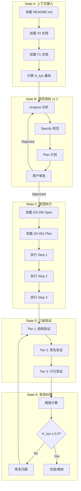

# WF-201: 宪法驱动开发工作流程 (CDD Workflow)

**工作流ID**: WF-201  
**版本**: v1.2.0 (Spec-Kit集成版)  
**来源**: CDD Skill + Spec-Kit  
**状态**: Active

---

## 1. 工作流概述

本工作流程定义了 CDD (Constitution-Driven Development) 的完整开发周期，集成了 Spec-Kit 的规范驱动理念。

### 1.1 核心理念

```
CDD = "宪法层" (What & Why & Constraints)
    + Spec-Kit = "执行层" (How & Implementation)
```

### 1.2 工作流图



---

## 2. State A: 上下文摄入 (Context Ingestion)

**目标**: 加载所有宪法文档，建立开发基线

### 2.1 执行步骤

| 步骤 | 操作 | 输出 | 验证 |
|------|------|------|------|
| A.1 | 加载 README.md | 项目背景 | Bootloader Input |
| A.2 | 加载 5 个 T0 文档 | 核心意识层 | 全部加载成功 |
| A.3 | 加载 3 个 T1 文档 | 系统公理层 | 全部加载成功 |
| A.4 | 计算 $H_{sys}$ 基线 | 熵值仪表盘 | $H_{sys} \leq 0.5$ |

### 2.2 T0 文档列表

| 文档 | 加载优先级 | 令牌预算 |
|------|------------|----------|
| activeContext.md | 必须 | <800 |
| KNOWLEDGE_GRAPH.md | 必须 | <800 |
| 01_basic_law_index.md | 必须 | <200 |
| 02_procedural_law_index.md | 必须 | <200 |
| 03_technical_law_index.md | 必须 | <200 |

### 2.3 T1 文档列表 (v1.2.0新增)

| 文档 | 用途 | 令牌预算 |
|------|------|----------|
| systemPatterns.md | Tier 1 验证依据 | <500 |
| techContext.md | Tier 2 验证依据 | <500 |
| behaviorContext.md | Tier 3 验证依据 | <500 |

---

## 3. State B: 规范规划 v1.2 (Spec-Driven Planning)

**目标**: 使用 Spec-Kit 方法论生成高质量规范和计划

### 3.1 B.1 Analyze 分析阶段

**输入**: 用户需求描述  
**输出**: 分析笔记 (research.md)

**执行内容**:
1. 理解用户需求，提取核心目标
2. 分析现有代码结构，识别影响范围
3. 检查 T1 文档中的相关约束
4. 识别技术风险和依赖

**输出模板**:
```markdown
## 分析结果

### 需求理解
- 核心目标: [描述]
- 成功标准: [描述]

### 影响分析
- 受影响模块: [列表]
- 需要新增接口: [列表]
- 需要新增数据模型: [列表]

### 技术风险
- 风险1: [描述]
- 风险2: [描述]
```

### 3.2 B.2 Specify 规范阶段 [Spec-Kit集成]

**输入**: 分析结果  
**输出**: DS-050 规范文档

**执行内容**:
1. 创建 `specs/[###-feature]/spec.md`
2. 填写 DS-050 模板:
   - 用户故事 (P1/P2/P3)
   - 验收场景 (Gherkin格式)
   - 功能/非功能需求
   - 数据模型设计
   - 接口定义
3. 进行宪法合规性检查
4. 输出到 `standards/DS-050_xxx.md`

**关键命令**:
```bash
# 创建规范
/cdd create spec "特性名称"
```

### 3.3 B.3 Plan 计划阶段 [Spec-Kit集成]

**输入**: DS-050 规范文档  
**输出**: DS-051 实施计划

**执行内容**:
1. 基于 Spec 创建实施计划
2. 分解为 3-5 个原子步骤
3. 每个步骤定义:
   - 目标
   - 任务清单
   - 代码变更
   - 回滚方案
4. 输出到 `standards/DS-051_xxx.md`

**关键命令**:
```bash
# 创建计划
/cdd create plan "特性名称"
```

### 3.4 B.4 用户审批

**输入**: DS-050 + DS-051  
**输出**: Approved / Rejected

**审批标准**:
- [ ] 规范覆盖所有 P1 用户故事
- [ ] 计划步骤原子化，可独立验证
- [ ] 风险已识别并有缓解措施
- [ ] 符合 T1 文档约束

---

## 4. State C: 受控执行 (Controlled Execution)

**目标**: 按计划执行编码，确保原子性和可追溯性

### 4.1 执行步骤

| 步骤 | 操作 | 验证 |
|------|------|------|
| C.1 | 加载 DS-050 Spec | 确认规范内容 |
| C.2 | 加载 DS-051 Plan | 确认当前步骤 |
| C.3 | 锁定 activeContext | 当前步骤状态更新 |
| C.4 | 执行编码 | 原子写入 |
| C.5 | 提交变更 | Git commit |

### 4.2 上下文打包 (Context Packer)

**v1.3.0 新特性**: 在执行前自动打包紧凑上下文

```python
def pack_execution_context(spec_path: str, plan_path: str, current_step: int) -> dict:
    """
    打包执行上下文
    
    Returns:
        - DS-050 Spec (relevant sections only)
        - DS-051 Plan (current step only)
        - Related T1 documents
    """
    pass
```

---

## 5. State D: 三级验证 (Three-Tier Verification)

**目标**: 确保代码符合规范

### 5.1 Tier 1: 结构验证

**验证对象**: `systemPatterns.md`  
**验证公式**: $S_{fs} \cong S_{doc}$

**检查清单**:
- [ ] 文件目录结构符合定义
- [ ] 命名规范正确
- [ ] 依赖方向正确 (core → infrastructure 禁止)

**验证命令**:
```bash
tree src/ > actual_structure.txt
diff systemPatterns.md#tree actual_structure.txt
```

### 5.2 Tier 2: 签名验证

**验证对象**: `techContext.md`  
**验证公式**: $I_{code} \supseteq I_{doc}$

**检查清单**:
- [ ] 接口定义完整实现
- [ ] 参数类型一致
- [ ] 返回类型一致

### 5.3 Tier 3: 行为验证

**验证对象**: `behaviorContext.md`  
**验证公式**: $B_{code} \equiv B_{spec}$

**检查清单**:
- [ ] P1 用户故事有对应测试
- [ ] 验收场景覆盖
- [ ] 业务不变量未违反

---

## 6. State E: 收敛纠错 (Convergence)

**目标**: 确保系统熵值达标

### 6.1 熵值计算

**公式**: $H_{sys} = 0.4 \cdot H_{cog} + 0.3 \cdot H_{struct} + 0.3 \cdot H_{align}$

### 6.2 收敛标准

| 状态 | $H_{sys}$ 范围 | 行动 |
|------|----------------|------|
| 🟢 优秀 | 0.0 - 0.3 | 可以合并 |
| 🟡 良好 | 0.3 - 0.5 | 关注负载，可以合并 |
| 🟠 警告 | 0.5 - 0.7 | 修复后再合并 |
| 🔴 危险 | 0.7 - 1.0 | 强制重构 |

### 6.3 闭环检查清单

| 检查项 | 标准 | 状态 |
|--------|------|------|
| T0 同步 | 5 个 T0 文档已更新 | ☐ |
| T1 同步 | 3 个 T1 文档已更新 | ☐ |
| Spec 同步 | DS-050/051 已归档 | ☐ |
| 外部审计 | (如有 T0 变更) 通过 | ☐ |
| 熵值达标 | $H_{sys} \leq 0.3$ | ☐ |

---

## 7. 外部审计触发条件

当以下情况发生时，自动触发外部审计:

| 触发条件 | 审计范围 | 模型 |
|----------|----------|------|
| T0 文档变更 | 全部 T0 文档 | deepseek-reasoner |
| T1 文档变更 | 相关 T1 文档 | deepseek-reasoner |

**审计报告**: `research_report/cdd_skill_audit_[TIMESTAMP].md`

---

## 8. 工作流命令

| 命令 | 功能 | 状态 |
|------|------|------|
| `/cdd start "任务描述"` | 启动 State A | ✅ |
| `/cdd analyze "需求"` | 执行 B.1 Analyze | ✅ |
| `/cdd create spec "特性名"` | 执行 B.2 Specify | ✅ v1.2 |
| `/cdd create plan "特性名"` | 执行 B.3 Plan | ✅ v1.2 |
| `/cdd approve` | 用户审批 | ✅ |
| `/cdd execute "步骤"` | 执行 State C | ✅ |
| `/cdd verify tier1/2/3` | 执行 State D | ✅ |
| `/cdd calibrate` | 执行 State E | ✅ |
| `/cdd audit` | 触发外部审计 | ✅ |

---

**引用标准**: WF-201 v1.2.0  
**依赖**: DS-050, DS-051, systemPatterns.md, techContext.md, behaviorContext.md  
**最后更新**: {{TIMESTAMP}}
