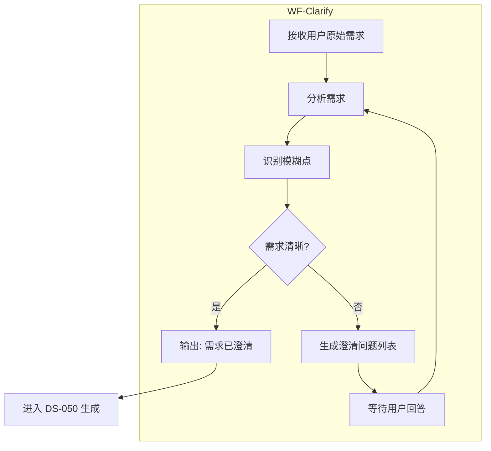

# WF-CLARIFY: 需求澄清工作流

**工作流ID**: WF-Clarify  
**版本**: v1.0.0  
**来源**: spec-kit clarify 理念  
**状态**: Active  
**位置**: State B 前置守卫

---

## 1. 工作流概述

### 1.1 目标

在生成 DS-050 规范前，强制 AI 分析用户需求，识别模糊点并提出澄清问题。这能有效减少因需求不清导致的返工。

### 1.2 触发条件

| 触发场景 | 是否触发 |
|----------|----------|
| 用户需求包含模糊词汇 (高性能、用户友好、快速) | ✅ |
| 缺少量化指标 (响应时间、数据量、并发数) | ✅ |
| 依赖关系不明确 (外部服务、第三方库) | ✅ |
| 安全/性能要求未定义 | ✅ |
| 已有明确的验收标准 | ❌ 跳过 |
| 用户明确要求"无需澄清" | ❌ 跳过 |

### 1.3 工作流图



---

## 2. 执行步骤

### Step 1: 接收与分析

**输入**: 用户原始需求描述  
**输出**: 需求分析结果

**分析维度**:

| 维度 | 检查项 |
|------|--------|
| **功能性** | 功能范围是否明确？边界条件是否覆盖？ |
| **性能** | 是否有响应时间、吞吐量要求？ |
| **安全** | 是否有认证/授权/加密要求？ |
| **兼容性** | 是否有平台/版本限制？ |
| **依赖** | 是否依赖外部服务/库？ |

### Step 2: 模糊点识别

**输出**: 模糊点清单

**常见模糊词汇**:
| 模糊词 | 需要澄清的问题 |
|--------|----------------|
| "高性能" | 具体的响应时间目标 (P95 < ?ms) |
| "用户友好" | 关键的可用性指标有哪些？ |
| "快速" | 具体的时间要求？ |
| "大量数据" | 数据规模？并发量？ |
| "安全" | 安全标准 (OWASP Top 10)？ |
| "易于维护" | 代码规范要求？文档要求？ |

### Step 3: 生成澄清问题

**输出**: 澄清问题列表

**格式**:
```markdown
## 澄清问题

| # | 模糊描述 | 澄清问题 | 优先级 | 状态 |
|---|----------|----------|--------|------|
| 1 | "高性能" | "请定义具体的响应时间目标 (P95 < 200ms?)" | 高 | 待回答 |
| 2 | "用户友好" | "请列出关键的可用性指标" | 中 | 待回答 |
| 3 | 未定义数据规模 | "请说明预计的用户量和日均请求数" | 高 | 待回答 |
```

### Step 4: 用户回答处理

**输入**: 用户对问题的回答  
**输出**: 澄清完成报告

**处理逻辑**:
1. 更新需求描述，融入用户回答
2. 标记问题为"已回答"
3. 重新进入 Step 2 分析
4. 直到所有高优先级问题已回答

---

## 3. 输出模板

### 3.1 澄清问题列表

```markdown
# 需求澄清报告

**原始需求**: [用户输入]
**分析时间**: {{TIMESTAMP}}
**状态**: [待回答 / 已澄清]

## 需求摘要

[AI 理解的需求概要]

## 识别出的模糊点

| # | 模糊描述 | 澄清问题 | 优先级 | 状态 |
|---|----------|----------|--------|------|
| 1 | [模糊词] | [问题] | 高/中/低 | 待回答 |

## 待用户回答

1. **问题1**: [问题内容]
   - 背景: [为什么需要澄清]
   - 建议: [可选的建议答案]

2. **问题2**: [问题内容]
   - ...

## 已回答的问题 (如有)

1. **Q1**: [问题]
   - A: [用户回答]

---

**下一步**:
- [ ] 用户回答上述问题
- [ ] AI 重新分析并生成 DS-050 规范
```

### 3.2 澄清完成报告

```markdown
# 需求澄清完成报告

**原始需求**: [用户输入]
**澄清完成时间**: {{TIMESTAMP}}

## 澄清后的需求描述

[融合用户回答后的完整需求描述]

## 已回答的问题

| # | 问题 | 回答 |
|---|------|------|
| 1 | [问题] | [回答] |
| 2 | [问题] | [回答] |

## 结论

**状态**: ✅ 已澄清，可进入 DS-050 规范生成

**建议**: 需求已足够清晰，可以开始生成特性规范。
```

---

## 4. 与 State B 集成

### 4.1 集成后的 State B 流程

```
State B: 规范驱动规划 (Spec-Driven Planning)

├── B.1 Clarify (前置守卫) [WF-Clarify]
│   ├── 接收用户需求
│   ├── 分析并识别模糊点
│   ├── 生成澄清问题
│   └── 用户回答 → 需求清晰
│
├── B.2 Specify (规范) [DS-050]
│   ├── 生成用户故事
│   ├── 定义验收标准
│   └── 输出: spec.md
│
├── B.3 Plan (计划) [DS-051]
│   ├── 分解实施步骤
│   ├── 定义回滚策略
│   └── 输出: plan.md
│
└── B.4 用户审批
```

### 4.2 CDD Skill Prompt 集成

在 State B 的系统提示中添加:

```markdown
## State B: 规范驱动规划

在生成 DS-050 规范前，必须先执行 WF-Clarify:

1. 分析用户需求，识别模糊点
2. 如果存在模糊定义（如"高性能"、"用户友好"），生成澄清问题列表
3. 等待用户回答后，重新分析
4. 只有需求清晰后，才能进入 DS-050 生成

**Clarify 触发条件**:
- 包含模糊词汇
- 缺少量化指标
- 依赖关系不明确

**输出**: 澄清问题列表 (如需要) → DS-050 规范
```

---

## 5. 实施检查清单

- [ ] 创建本工作流文件
- [ ] 更新 SKILL.md，添加 Clarify 触发逻辑
- [ ] 更新 WF-201，集成 Clarify 到 State B
- [ ] 创建澄清问题输出模板
- [ ] 外部审计验证合规性

---

**引用标准**: WF-Clarify v1.0.0  
**依赖**: DS-050, DS-051, WF-201  
**最后更新**: {{TIMESTAMP}}
