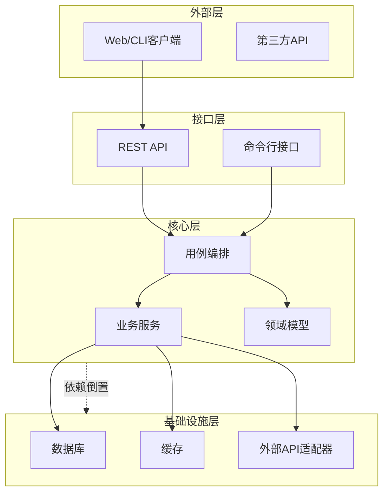

# System Patterns (系统模式)

**类型**: T1 (System Axioms)
**版本**: v1.8.0
**用途**: 定义系统的架构蓝图与代码结构约束 (Tier 1 验证依据)

---

## 1. 目录结构约束 (Directory Topology)

```bash
# 使用 'tree -L 2' 生成并在此处维护
src/
├── core/           # 核心业务逻辑 (无外部依赖)
├── infrastructure/ # 数据库与API适配器
├── interfaces/     # 对外接口 (API/CLI)
└── shared/         # 共享工具与类型

tests/
├── unit/           # 单元测试
├── integration/    # 集成测试
└── e2e/            # 端到端测试

```

**约束原则**:
1. `core` 严禁引用 `infrastructure` (依赖倒置原则)
2. 所有外部 API 调用必须封装在 `infrastructure` 中
3. `interfaces` 只能通过 `core` 的接口与内部通信

---

## 2. 架构分层图 (Architecture Layers)



---

## 3. 设计模式 (Design Patterns)

| 模式 | 应用场景 | 实现示例 | 约束 |
|------|----------|----------|------|
| **Repository** | 数据持久化 | `UserRepository` 实现 `IUserRepository` | 禁止直接使用 ORM 查询 |
| **Factory** | 复杂对象创建 | `OrderFactory` | 返回接口类型 |
| **Strategy** | 算法切换 | 支付策略 (Alipay/WeChat) | 必须实现统一接口 |
| **Observer** | 事件通知 | `EventDispatcher` | 异步处理 |
| **Decorator** | 增强功能 | `LoggingServiceDecorator` | 组合优于继承 |

---

## 4. 代码组织规则

### 4.1 文件命名规范

| 类型 | 命名模式 | 示例 |
|------|----------|------|
| 模块目录 | `snake_case` | `user_service/` |
| Python文件 | `snake_case.py` | `user_repository.py` |
| 测试文件 | `test_*.py` | `test_user_service.py` |
| 配置文件 | `config_*.yaml` | `config_database.yaml` |

### 4.2 类/接口命名规范

| 类型 | 命名模式 | 示例 |
|------|----------|------|
| 接口/Protocol | `I{Name}` | `IUserService` |
| 实现类 | `{Name}Impl` 或 具体名 | `UserServiceImpl` |
| 异常类 | `{Domain}Error` | `UserNotFoundError` |
| 常量 | `UPPER_SNAKE_CASE` | `MAX_RETRY_COUNT` |

---

## 5. 关键决策记录 (ADR Summary)

| ID | 决策 | 状态 | 日期 |
|----|------|------|------|
| ADR-001 | 采用微内核架构，插件化扩展 | 生效 | 2026-01-01 |
| ADR-002 | 数据库层使用 ORM 但禁止级联删除 | 生效 | 2026-01-01 |
| ADR-003 | 所有 API 响应使用统一的 Result 包装 | 生效 | 2026-01-01 |
| ADR-004 | 采用事件溯源模式处理订单状态变更 | 待定 | - |

---

## 6. Tier 1 验证检查清单

```bash
# 验证命令: 在项目根目录执行
tree -L 2 src/ > current_structure.txt
diff -u systemPatterns.md#tree current_structure.txt

# 通过条件: 差异行数 < 3 (允许注释差异)
```

| 检查项 | 验证方法 | 通过标准 |
|--------|----------|----------|
| 目录结构 | `tree src/` vs 定义 | 完全匹配 |
| 依赖方向 | 代码检查 | `core` 不引用 `infrastructure` |
| 命名规范 | 脚本扫描 | 命名违规数 = 0 |

---

**宪法依据**: §101§105
**最后更新**: {{TIMESTAMP}}
**版本**: v1.8.0
