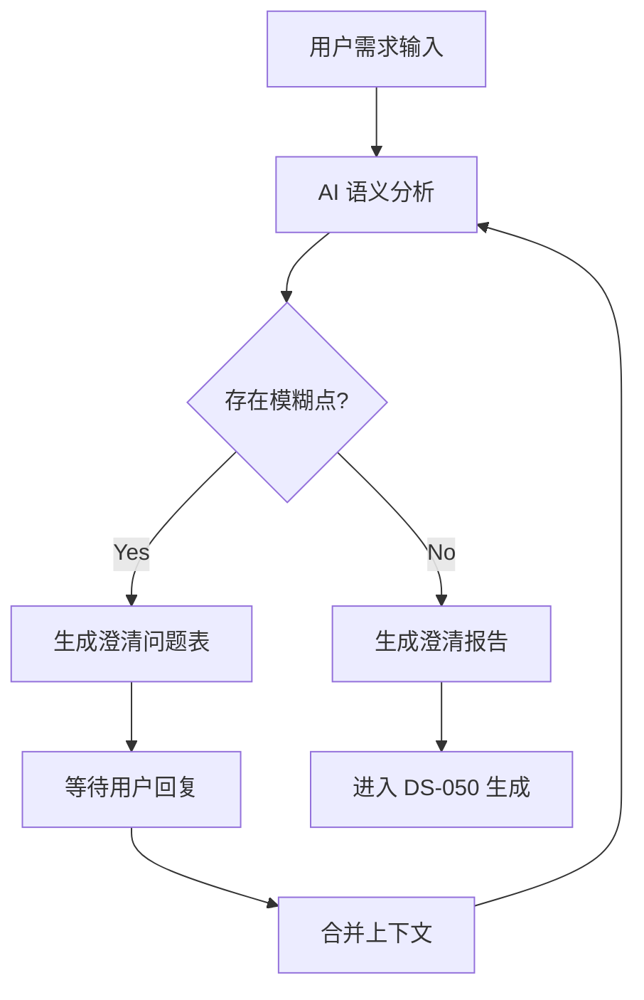

# WF-CLARIFY: 需求澄清工作流

**ID**: WF-CLARIFY
**类型**: Protocol (Workflow)
**版本**: v1.0.0
**状态**: Active
**触发**: State B (Planning) 初始阶段

---

## 1. 目标
在生成 DS-050 (Spec) 之前，通过结构化的问答消除需求中的模糊性（Ambiguity），确保输入的熵值最低。

## 2. 流程图

## 3. 执行步骤

### Step 1: 模糊性扫描 (Ambiguity Scanning)

AI 必须检查以下维度的模糊性：

1. **量化指标**: 是否包含 "高性能", "快速", "大量" 等未量化词汇？
2. **边界条件**: 异常情况（如断网、超大文件）如何处理？
3. **技术约束**: 兼容性、依赖库版本、部署环境？

### Step 2: 生成问题表 (Clarification Matrix)

如果发现模糊点，输出以下表格：

| ID | 模糊点原文 | 风险 | 建议问题 | 用户回复 (预留) |
| --- | --- | --- | --- | --- |
| Q1 | "支持大文件上传" | 内存溢出风险 | "请定义'大文件'的具体阈值（如 100MB? 1GB?）" |  |
| Q2 | "界面要好看" | 验收标准主观 | "是否有参考的设计风格或竞品？" |  |

### Step 3: 转换协议 (Transition Protocol)

当所有高风险问题解决后，生成 **澄清报告 (Clarification Report)**，其内容直接映射到 `DS-050`：

* 用户回复的量化指标 -> `DS-050` 的 **非功能需求 (NFR)**
* 用户确认的边界行为 -> `DS-050` 的 **用户故事验收标准 (AC)**

---

**输出物**:

* 中间产物: `clarification_questions.md`
* 最终产物: `clarified_requirements_summary.md` (作为 DS-050 的输入)
