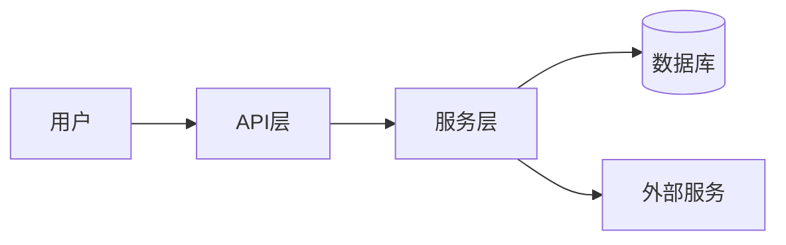

# DS-050: 特性规范标准实现 (Feature Specification Standard)

**类型**: T2 (Executable Standards)  
**版本**: v1.0.0  
**来源**: 基于 spec-kit spec-template.md  
**用途**: State B 阶段生成特性规范文档

---

## 1. 文档元数据

```markdown
**特性名称**: {{feature_name}}
**特性ID**: {{feature_id}}
**特性分支**: `{{git_branch}}`
**创建时间**: {{timestamp}}
**Spec版本**: {{project_version}} (Draft)
**状态**: Draft → Review → Approved → Implemented
**输入**: 用户需求描述 "{{feature_description}}"
**作者**: {{author}}
**项目版本**: {{project_version}}
**活跃上下文版本**: {{active_context_version}}
**系统模式版本**: {{system_patterns_version}}
```

---

## 2. 宪法合规性检查 [v1.0.0新增]

> **⚠️ 必须填写**: 在编写规范前，请确认以下合规性项

| 检查项 | 引用 | 状态 | 说明 |
|--------|------|------|------|
| 架构一致性 | `systemPatterns.md` | ☐ | 特性是否符合目录结构约束 |
| 接口兼容性 | `techContext.md` | ☐ | 是否复用现有接口或定义新接口 |
| 行为约束 | `behaviorContext.md` | ☐ | 是否违反业务不变量 |
| 熵值影响预估 | `activeContext.md` | ☐ | 预计对 $H_{sys}$ 的影响 |

---

## 3. 用户场景与测试 (User Scenarios)

> **重要**: 用户故事应按重要性排序，每个故事必须可独立测试。

### 3.1 用户故事 1 (Priority: P1 - 最高优先级)

**故事描述**: [用自然语言描述用户旅程]

**优先级理由**: [解释价值和优先级原因]

**独立测试方法**: [描述如何独立测试该功能]

**验收场景 (Gherkin格式)**:

```gherkin
Scenario 1: [场景标题]
  Given [初始状态]
  When [用户动作]
  Then [预期结果]

Scenario 2: [边界场景]
  Given [边界状态]
  When [用户动作]
  Then [预期结果]
```

### 3.2 用户故事 2 (Priority: P2)

[同上格式]

### 3.3 用户故事 3 (Priority: P3)

[同上格式]

---

## 4. 非功能性需求 (Requirements)

### 4.1 功能性需求

| ID | 描述 | 优先级 | 验收标准 |
|----|------|--------|----------|
| FR-001 | [需求描述] | P1/P2/P3 | [可验证标准] |
| FR-002 | [需求描述] | P1/P2/P3 | [可验证标准] |

### 4.2 非功能性需求

| 维度 | 要求 | 验证方法 |
|------|------|----------|
| **性能** | [如: API响应 < 200ms] | 性能测试 |
| **安全** | [如: 认证/授权检查] | 安全测试 |
| **兼容性** | [如: 支持浏览器版本] | 兼容性测试 |
| **可用性** | [如: 99.9% uptime] | 监控指标 |

---

## 5. 数据模型 (Data Model)

### 5.1 新增实体

```markdown
| 实体 | 字段 | 类型 | 约束 | 说明 |
|------|------|------|------|------|
| [Entity] | id | UUID | PK | 主键 |
| | name | String | NOT NULL | 名称 |
| | ... | | | |
```

### 5.2 数据流



---

## 6. 接口定义 (Interface)

### 6.1 API 端点

| 方法 | 路径 | 输入 | 输出 | 说明 |
|------|------|------|------|------|
| POST | `/api/v1/...` | `{...}` | `{...}` | [描述] |
| GET | `/api/v1/...` | - | `{...}` | [描述] |

### 6.2 接口签名 (引用 techContext)

> **检查**: 此特性复用了以下接口: `techContext.md#I...`
> **新增**: 以下接口需添加到 `techContext.md`:
```typescript
interface I{{FeatureName}}Service {
  // 接口定义
}
```

---

## 7. 验证计划 (Verification Plan)

### 7.1 Tier 1 验证 (结构)

- [ ] 文件结构符合 `systemPatterns.md` 定义
- [ ] 目录命名规范正确

### 7.2 Tier 2 验证 (签名)

- [ ] 接口签名与定义一致
- [ ] 数据契约符合 `techContext.md`

### 7.3 Tier 3 验证 (行为)

- [ ] 单元测试覆盖所有用户故事 P1
- [ ] 集成测试通过
- [ ] 业务不变量保持 (无违反 `behaviorContext.md`)

---

## 8. 风险与依赖

| 风险/依赖 | 影响 | 缓解措施 |
|-----------|------|----------|
| [风险1] | 高/中/低 | [措施] |
| [依赖1] | [影响] | [措施] |

---

## 9. 验收签名

| 角色 | 姓名 | 日期 | 签名 |
|------|------|------|------|
| 架构师 | | | ☐ |
| 产品经理 | | | ☐ |
| 开发者 | | | ☐ |

---

**引用标准**: DS-050 v1.0.0  
**最后更新**: {{TIMESTAMP}}  
**版本**: v1.0.0
