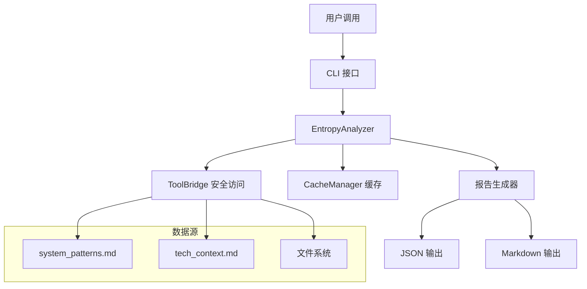

# DS-055: 自动化熵值优化器特性规范 (Automated Entropy Optimizer Feature Specification)

**类型**: T2 (Executable Standards)  
**版本**: v0.1.0 (Draft)  
**来源**: 基于 DS-050 标准模板，定制用于熵值优化器  
**用途**: State B 阶段生成熵值优化器特性规范

---

## 1. 文档元数据

```markdown
**特性名称**: 自动化熵值优化器 (MVP Phase 1)
**特性ID**: FEAT-ENTROPY-OPTIMIZER-001
**特性分支**: `feature/entropy-optimizer-phase1`
**创建时间**: 2026-02-06T01:31:40+08:00
**Spec版本**: CDD v1.6.1 (Secure Edition)
**状态**: Draft → Review → Approved → Implemented
**输入**: "实施自动化熵值优化器，从被动监测升级为主动优化"
**作者**: CDD 架构师 & 工程团队
**项目版本**: CDD v1.6.1
**活跃上下文版本**: v1.6.1
**系统模式版本**: v1.6.1
```

---

## 2. 宪法合规性检查 [遵循 DS-050 v1.0.0]

> **⚠️ 必须填写**: 在编写规范前，请确认以下合规性项

| 检查项 | 引用 | 状态 | 说明 |
|--------|------|------|------|
| 架构一致性 | `systemPatterns.md` | ✅ | 符合 CDD 工具链目录结构约束 |
| 接口兼容性 | `techContext.md` | ✅ | 复用现有 `ToolBridge`、`CacheManager` 接口 |
| 行为约束 | `behaviorContext.md` | ✅ | 分析过程为零副作用，不违反业务不变量 |
| 熵值影响预估 | `activeContext.md` | ✅ | 预计对 $H_{sys}$ 影响为 0 或负值（熵减） |
| **孢子协议合规** | **Technical Law §106.1** | ✅ | 所有文件操作通过 `ToolBridge`，严格隔离 |

**宪法依据**:
- **§106.1
- **§310
- **§102

---

## 3. 用户场景与测试 (User Scenarios)

> **重要**: 用户故事应按重要性排序，每个故事必须可独立测试。

### 3.1 用户故事 1 (Priority: P1 - 最高优先级)

**故事描述**: 作为 CDD 工程师，我希望系统能识别高熵热点，以便我能针对性地进行优化。

**优先级理由**: 这是从"被动监测"到"主动治理"的关键一步。没有准确的熵值归因，就无法进行有效的优化。

**独立测试方法**: 创建一个测试目录结构，故意违反 `system_patterns.md` 定义，验证分析器能正确识别违规。

**验收场景 (Gherkin格式)**:

```gherkin
Scenario 1: 识别结构熵 ($H_{struct}$) 热点
  Given 项目目录结构违反 system_patterns.md 定义
  When 运行熵值分析器
  Then 分析器应报告违规路径和熵贡献值
  And 熵贡献值与违规严重程度成正比

Scenario 2: 安全边界检查
  Given 分析器运行时
  When 尝试访问项目边界外的文件
  Then ToolBridge 应拦截访问并抛出 PermissionError
  And 分析器应记录安全违规并继续执行
```

### 3.2 用户故事 2 (Priority: P2)

**故事描述**: 作为项目负责人，我希望查看详细的熵值诊断报告，以便了解系统健康状态。

**优先级理由**: 决策需要数据支撑。Markdown 格式的报告能提供人类可读的洞察。

**独立测试方法**: 运行分析器，验证输出包含全局熵值和热点列表。

**验收场景 (Gherkin格式)**:

```gherkin
Scenario: 生成双格式诊断报告
  Given 项目存在多个熵源
  When 运行熵值分析器并指定输出格式
  Then 系统应同时生成 JSON 和 Markdown 报告
  And JSON 报告应包含机器可读的热点数据结构
  And Markdown 报告应包含可读性强的解释和建议
```

### 3.3 用户故事 3 (Priority: P3)

**故事描述**: 作为开发者，我希望分析过程快速且无副作用，以免干扰正常开发流程。

**优先级理由**: 工具应该帮助而不是阻碍开发。性能和无副作用是工具可用性的关键。

**独立测试方法**: 测量分析器在典型项目上的执行时间，检查是否有文件被修改。

**验收场景 (Gherkin格式)**:

```gherkin
Scenario: 零副作用分析
  Given 项目目录的初始状态已被记录
  When 运行熵值分析器
  Then 分析完成后项目文件系统应无任何变化
  And 不应创建临时文件残留

Scenario: 性能基准
  Given 一个包含 1000 个文件的中型项目
  When 运行熵值分析器
  Then 总执行时间应小于 5 秒
  And 内存使用量应保持稳定
```

---

## 4. 非功能性需求 (Requirements)

### 4.1 功能性需求

| ID | 描述 | 优先级 | 验收标准 |
|----|------|--------|----------|
| FR-001 | 结构熵 ($H_{struct}$) 分析 | P1 | 能识别目录结构违反，计算局部熵贡献 |
| FR-002 | 对齐熵 ($H_{align}$) 分析 | P2 | 能识别接口实现不匹配 |
| FR-003 | 认知熵 ($H_{cog}$) 分析 | P3 | 能分析代码复杂度和注释密度 |
| FR-004 | 热点识别与排序 | P1 | 输出 Top-N 高熵热点，按熵贡献排序 |
| FR-005 | 双格式输出 | P2 | 同时支持 JSON（机器）和 Markdown（人类） |
| FR-006 | 孢子协议合规 | P1 | 100% 文件操作通过 `ToolBridge` |

### 4.2 非功能性需求

| 维度 | 要求 | 验证方法 |
|------|------|----------|
| **性能** | 分析时间 < 5秒 (中型项目) | 性能测试，计时器 |
| **安全** | 零路径遍历漏洞 | 安全测试，故意提供恶意路径 |
| **兼容性** | 与 Python 3.9+ 兼容 | 多版本 Python 环境测试 |
| **可用性** | CLI 接口直观易用 | 用户验收测试 |
| **可靠性** | 异常处理完备，不崩溃 | 异常注入测试 |

---

## 5. 数据模型 (Data Model)

### 5.1 核心数据实体

```markdown
| 实体 | 字段 | 类型 | 约束 | 说明 |
|------|------|------|------|------|
| **Hotspot** | id | String | PK | 热点唯一标识符 |
| | path | String | NOT NULL | 相对路径 |
| | entropy_score | Float | [0.0, 1.0] | 局部熵贡献值 |
| | entropy_type | Enum | {STRUCTURAL, ALIGNMENT, COGNITIVE} | 熵值类型 |
| | reason | String | | 熵增原因描述 |
| | suggested_fix | String | | 修复建议（可选） |
| **DiagnosticReport** | timestamp | DateTime | NOT NULL | 报告生成时间 |
| | global_entropy | Float | [0.0, 1.0] | 全局熵值 $H_{sys}$ |
| | hotspots | List[Hotspot] | | 热点列表 |
| | summary | String | | 人类可读摘要 |
```

### 5.2 数据流



---

## 6. 接口定义 (Interface)

### 6.1 CLI 接口

| 命令 | 参数 | 说明 | 示例 |
|------|------|------|------|
| `python measure_entropy.py --analyze` | `--output`, `--format`, `--top-n` | 运行分析模式 | `--analyze --output report.json --format json` |
| `python measure_entropy.py --analyze-struct` | `--verbose` | 仅分析结构熵 | `--analyze-struct --verbose` |

### 6.2 程序接口 (引用 techContext)

> **检查**: 此特性复用了以下接口: `tool_bridge.py#ToolBridge`, `cache_manager.py#CacheManager`
> **新增**: 以下接口需添加到 `tech_context.md`:

```python
class IEntropyAnalyzer:
    """熵值分析器接口"""
    
    def analyze_structural_entropy(self) -> List[Dict[str, Any]]:
        """
        分析结构熵 ($H_{struct}$) 热点
        
        Returns:
            List[Hotspot]: 结构熵热点列表，每个热点包含:
                - path: 相对路径
                - score: 熵贡献值 (0.0-1.0)
                - reason: 违规描述
                - suggested_fix: 修复建议
        """
    
    def analyze_alignment_entropy(self) -> List[Dict[str, Any]]:
        """分析对齐熵 ($H_{align}$) 热点"""
    
    def analyze_cognitive_entropy(self) -> List[Dict[str, Any]]:
        """分析认知熵 ($H_{cog}$) 热点"""
    
    def generate_diagnostic_report(
        self, 
        format: str = "both"
    ) -> Union[Dict[str, Any], str, Tuple[Dict[str, Any], str]]:
        """
        生成诊断报告
        
        Args:
            format: 输出格式 ("json", "markdown", "both")
        
        Returns:
            根据 format 返回相应格式的数据
        """
```

---

## 7. 验证计划 (Verification Plan)

### 7.1 Tier 1 验证 (结构)

- [ ] 文件结构符合 `system_patterns.md` 定义
  - `scripts/utils/entropy_analyzer.py` 位于正确位置
  - 测试文件位于 `tests/test_entropy_analyzer.py`
- [ ] 目录命名规范正确

### 7.2 Tier 2 验证 (签名)

- [ ] 接口签名与 `tech_context.md` 定义一致
- [ ] `EntropyAnalyzer` 正确实现 `IEntropyAnalyzer` 接口
- [ ] 与 `ToolBridge`、`CacheManager` 的集成正确

### 7.3 Tier 3 验证 (行为)

- [ ] 单元测试覆盖所有 P1 用户故事
- [ ] 集成测试通过 (与现有工具链集成)
- [ ] 孢子协议合规测试通过 (零边界违规)
- [ ] 性能测试通过 (< 5秒执行时间)

---

## 8. 风险与依赖

| 风险/依赖 | 影响 | 缓解措施 |
|-----------|------|----------|
| **代码解析复杂性** | 中 | Phase 1 仅实现结构熵分析，避免复杂代码解析 |
| **性能瓶颈** | 低 | 使用 `CacheManager` 缓存计算结果 |
| **孢子协议误判** | 高 | 严格通过 `ToolBridge` 访问文件，添加额外边界检查 |
| **输出格式不一致** | 中 | 使用标准化数据模型，JSON Schema 验证 |
| **与现有脚本冲突** | 低 | 保持 `measure_entropy.py` 向后兼容，新增功能作为扩展 |

---

## 9. 验收签名

| 角色 | 姓名 | 日期 | 签名 |
|------|------|------|------|
| 架构师 | CDD 架构师 | 2026-02-06 | ☐ |
| 产品经理 | CDD 产品负责人 | 2026-02-06 | ☐ |
| 开发者 | CDD 工程团队 | 2026-02-06 | ☐ |

---

**引用标准**: 
- DS-050 v1.0.0 (特性规范模板)
- DS-039 v1.0.0 (工具桥接标准)
- Basic Law §106.1
- Technical Law §310

**最后更新**: 2026-02-06T01:31:40+08:00  
**版本**: v0.1.0 (Draft)

---

## 附录 A: 熵值计算模型 (Phase 1)

### 结构熵 ($H_{struct}$) 计算公式

对于每个目录或文件，结构熵贡献计算如下：

$$
\text{score}_{\text{struct}}(p) = w_{\text{missing}} \cdot \frac{N_{\text{missing}}}{N_{\text{expected}}} + w_{\text{extra}} \cdot \frac{N_{\text{extra}}}{N_{\text{actual}}}
$$

其中:
- $N_{\text{missing}}$: 缺失的预期文件/目录数
- $N_{\text{extra}}$: 多余的未定义文件/目录数
- $N_{\text{expected}}$: `system_patterns.md` 中定义的总数
- $N_{\text{actual}}$: 实际存在的文件/目录总数
- $w_{\text{missing}} = 0.7$, $w_{\text{extra}} = 0.3$ (缺失比多余更严重)

### 热点排序算法

热点按以下公式综合排序：

$$
\text{priority}(h) = \alpha \cdot \text{score}(h) + \beta \cdot \text{impact}(h) + \gamma \cdot \text{ease}(h)
$$

其中:
- $\text{score}(h)$: 熵贡献值 (0.0-1.0)
- $\text{impact}(h)$: 影响范围 (受影响的文件数比例)
- $\text{ease}(h)$: 修复难度估计 (1.0 = 容易, 0.0 = 困难)
- $\alpha = 0.6$, $\beta = 0.3$, $\gamma = 0.1$

---

**宪法注记**: 本规范严格遵循 CDD 宪法框架，特别是 **§106.1§102
