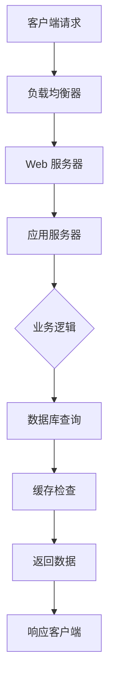

# {{PROJECT_NAME}} 架构概览

> **版本**: 1.0.0  
> **最后更新**: {{TIMESTAMP}}  
> **类别**: 架构文档  
> **目标读者**: 架构师、技术负责人、高级开发者

## 🏗️ 系统架构

### 架构原则

{{PROJECT_NAME}} 基于以下核心架构原则构建：

1. **模块化设计**: 清晰的关注点分离，高内聚低耦合
2. **可扩展性**: 支持水平扩展和垂直扩展
3. **可维护性**: 代码组织清晰，文档完善
4. **可靠性**: 错误处理和容错机制
5. **安全性**: 纵深防御，最小权限原则

### 技术栈

#### 后端技术栈
- **语言**: Python 3.12+
- **Web 框架**: FastAPI / Django / Flask (根据实际选择)
- **数据库**: PostgreSQL / MySQL / SQLite
- **ORM**: SQLAlchemy / Django ORM
- **缓存**: Redis / Memcached
- **消息队列**: RabbitMQ / Redis Streams
- **任务队列**: Celery / RQ

#### 前端技术栈 (如果适用)
- **框架**: React 18+ / Vue 3 / Angular
- **构建工具**: Vite / Webpack
- **样式**: Tailwind CSS / CSS Modules
- **状态管理**: Redux / Zustand / Pinia
- **测试**: Jest / Vitest / Cypress

#### 基础设施
- **容器**: Docker, Docker Compose
- **编排**: Kubernetes (可选)
- **CI/CD**: GitHub Actions / GitLab CI
- **监控**: Prometheus, Grafana
- **日志**: ELK Stack / Loki

### 架构模式

#### 分层架构
```
┌─────────────────────────────────────┐
│         表示层 (Presentation)        │
│  ┌─────────────┐  ┌─────────────┐  │
│  │   Web API   │  │     UI      │  │
│  └─────────────┘  └─────────────┘  │
├─────────────────────────────────────┤
│         业务层 (Business)           │
│  ┌─────────────┐  ┌─────────────┐  │
│  │  服务逻辑   │  │  领域模型   │  │
│  └─────────────┘  └─────────────┘  │
├─────────────────────────────────────┤
│         数据层 (Data)               │
│  ┌─────────────┐  ┌─────────────┐  │
│  │   仓库层    │  │  数据访问   │  │
│  └─────────────┘  └─────────────┘  │
└─────────────────────────────────────┘
```

#### 微服务架构 (可选)
```
┌─────────┐    ┌─────────┐    ┌─────────┐
│ 用户服务 │    │ 订单服务 │    │ 支付服务 │
└─────────┘    └─────────┘    └─────────┘
     │              │              │
     └──────────────┼──────────────┘
                    │
             ┌─────────────┐
             │   API网关   │
             └─────────────┘
                    │
             ┌─────────────┐
             │    客户端    │
             └─────────────┘
```

### 核心组件

#### 1. 认证与授权
- **身份验证**: JWT, OAuth 2.0, Session-based
- **授权**: RBAC (基于角色的访问控制)
- **安全**: HTTPS, CSRF 保护, CORS 配置

#### 2. 数据处理
- **数据库设计**: 规范化/反规范化平衡
- **缓存策略**: 多级缓存 (内存, Redis, CDN)
- **数据迁移**: Alembic / Django Migrations

#### 3. API 设计
- **RESTful 原则**: 资源导向，HTTP 语义
- **版本控制**: URL 版本或请求头版本
- **文档**: OpenAPI/Swagger 规范

#### 4. 前端架构 (如果适用)
- **组件设计**: 原子设计模式
- **状态管理**: 全局状态 vs 局部状态
- **路由**: 客户端路由，代码分割

### 部署架构

#### 开发环境
```yaml
开发环境:
  - 本地 Docker Compose
  - 热重载支持
  - 调试工具集成
```

#### 生产环境
```yaml
生产环境:
  - 容器化部署 (Docker)
  - 负载均衡 (Nginx/Traefik)
  - 自动伸缩
  - 蓝绿部署/金丝雀发布
```

### 数据流

#### 典型请求流程


#### 异步任务流程


### 安全架构

#### 安全层次
1. **网络层**: 防火墙, VPN, 网络隔离
2. **应用层**: 输入验证, 输出编码, 会话管理
3. **数据层**: 加密, 访问控制, 审计日志
4. **基础设施**: 安全组, IAM 策略, 漏洞扫描

#### 合规性考虑
- **数据保护**: GDPR, CCPA
- **行业标准**: PCI DSS, HIPAA (如果适用)
- **安全认证**: ISO 27001, SOC 2

### 性能考量

#### 性能指标
- **响应时间**: P95 < 200ms, P99 < 500ms
- **吞吐量**: 根据业务需求定义
- **可用性**: 99.9% uptime SLA
- **可扩展性**: 支持 10x 流量增长

#### 优化策略
- **数据库优化**: 索引, 查询优化, 分库分表
- **缓存策略**: CDN, 内存缓存, 数据库缓存
- **代码优化**: 异步处理, 批处理, 懒加载

### 监控与运维

#### 监控体系
- **基础设施监控**: CPU, 内存, 磁盘, 网络
- **应用监控**: 请求率, 错误率, 延迟
- **业务监控**: 关键业务指标, 用户行为
- **日志收集**: 结构化日志, 分布式追踪

#### 告警策略
- **紧急告警**: 服务不可用, 数据丢失
- **警告告警**: 性能下降, 容量预警
- **信息告警**: 配置变更, 部署完成

### 扩展路线图

#### 短期扩展 (0-6个月)
1. 增加缓存层
2. 实现异步任务队列
3. 优化数据库查询
4. 添加监控告警

#### 中期扩展 (6-12个月)
1. 引入微服务架构
2. 实现多区域部署
3. 添加高级分析功能
4. 优化移动端体验

#### 长期扩展 (12+个月)
1. AI/ML 功能集成
2. 区块链/去中心化特性
3. 国际化支持
4. 生态平台建设

### 技术决策记录

#### 重要技术决策
| 决策 | 理由 | 备选方案 | 影响 |
|------|------|----------|------|
| 使用 FastAPI | 高性能, 异步支持, 自动文档 | Flask, Django | 开发效率提升 30% |
| 选择 PostgreSQL | ACID 合规, 丰富功能, 社区支持 | MySQL, MongoDB | 数据一致性保证 |
| 采用 Docker | 环境一致性, 部署简化 | 虚拟机, 裸机 | 部署时间减少 50% |

### 架构演进

#### 当前架构状态
- **成熟度**: 生产就绪
- **复杂度**: 中等
- **维护成本**: 低
- **团队熟悉度**: 高

#### 架构债务
1. **技术债务**: 需要重构的模块
2. **文档债务**: 需要完善的文档
3. **测试债务**: 需要增加的测试覆盖率

### 相关文档

- **详细设计文档**: `memory_bank/t3_documentation/modular-architecture.md`
- **API 文档**: `memory_bank/t3_documentation/api-reference.md`
- **部署指南**: `memory_bank/t3_documentation/deployment.md`
- **开发指南**: `memory_bank/t3_documentation/getting-started.md`

---

**架构状态**: ✅ 生产就绪 (v1.0.0)  
**架构复杂度**: 🟡 中等  
**技术债务**: 🟢 低  
**扩展性**: 🟢 良好

*文档版本: v1.0.0 | 更新日期: {{TIMESTAMP}}*